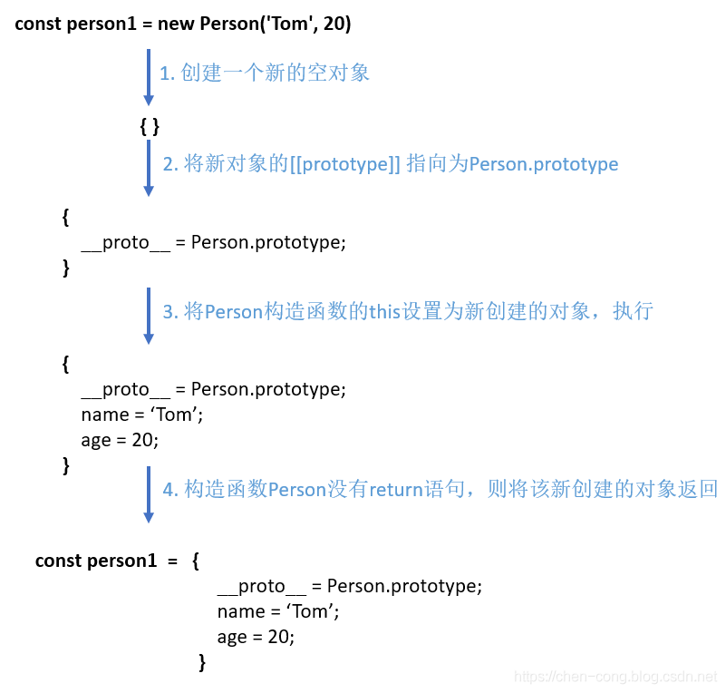

## new关键字进行的操作

new关键字进行了如下的操作（为了便于描述，obj用来表示创建的空对象、用constructor来表示构造函数）：

1. 创建一个空对象obj（{}）；

2. 将obj的[[prototype]]属性指向构造函数constructor的原型（即obj.[[prototype]] = constructor.prototype）。

3. 将构造函数constructor内部的this绑定到新建的对象obj，执行constructor（也就是跟调用普通函数一样，只是此时函数的this为新创建的对象obj而已，就好像执行obj.constructor()一样）；

4. 若构造函数没有返回非原始值（即不是引用类型的值），则返回该新建的对象obj（默认会添加return this）。否则，返回引用类型的值。

   

   

   [[prototype]]属性是隐藏的，不过目前大部分新浏览器实现方式是使用__proto__来表示。构造函数的prototype属性我们是可以显式访问的。




```javascript
function myNew(construtorFn, ...args) {
  // obj.__proto__ = construtorFn.prototype
  const obj = Object.create(construtorFn.prototype);
  // const result = construtorFn.apply(obj,args);
  const result =  construtorFn.call(obj,...args);
  // return Object.prototype.toString.call(result) == '[object Object]'? result : {}
  return result instanceof Object ? result : obj;
}
```

