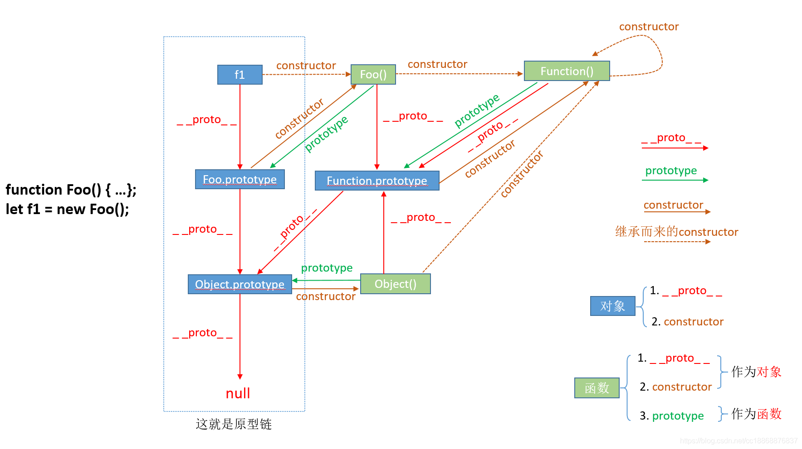
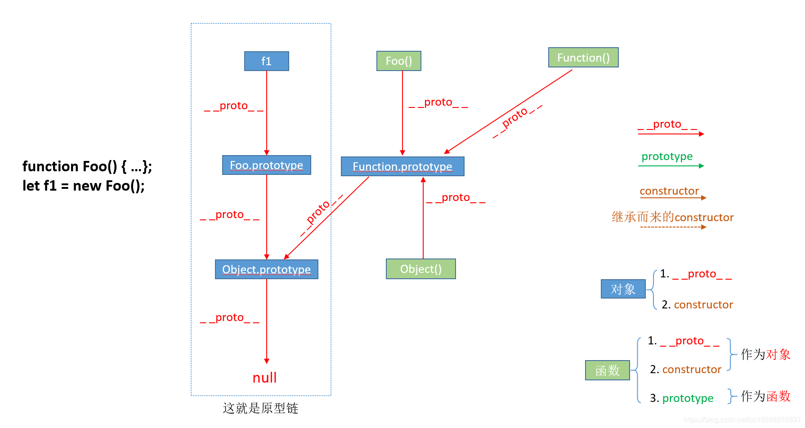
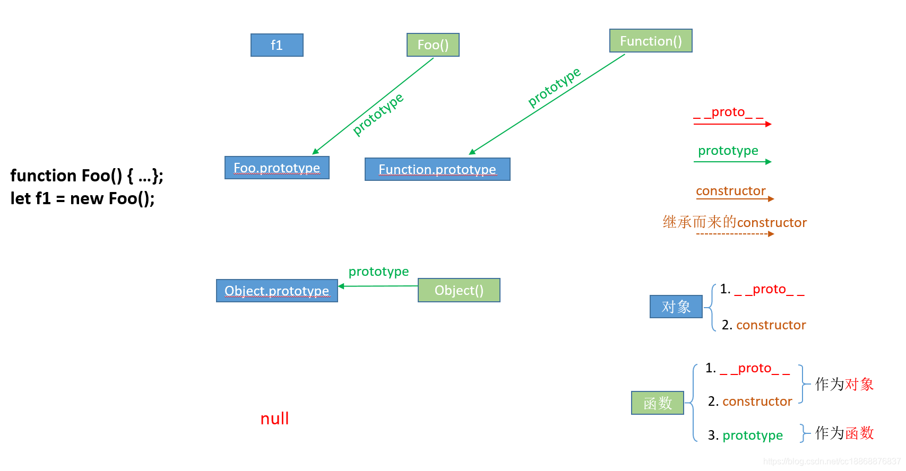
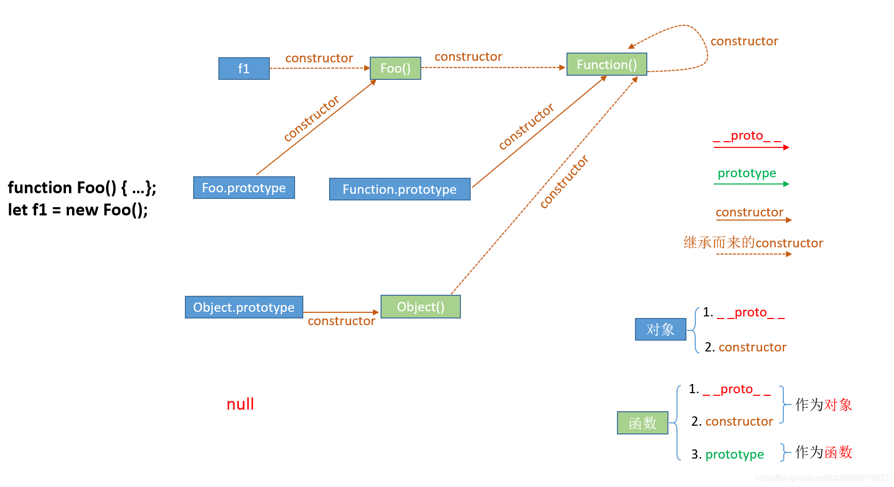
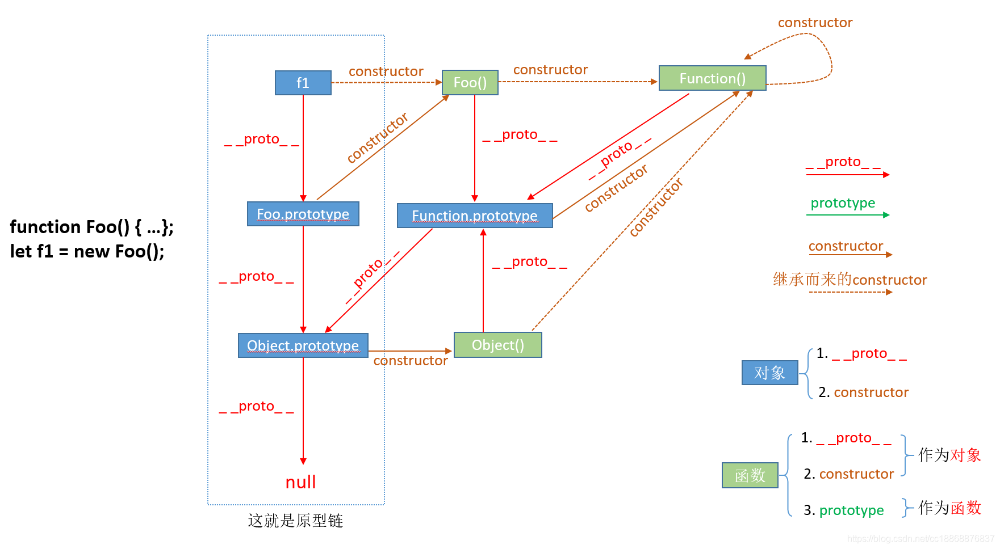

# 

```javascript
function Foo() {}
let f1 = new Foo();
// 创建一个构造函数Foo()，并用new关键字实例化该构造函数得到一个实例化对象f1

//new操作符将函数作为构造器进行调用时的过程：
//函数被调用，然后新创建一个对象，并且成了函数的上下文（也就是此时函数内部的this是指向该新创建的对象，这意味着我们可以在构造器函数内部通过this参数初始化值），最后返回该新对象的引用
```



# 1.__proto__属性

①`__proto__`和`constructor`属性是**对象**所独有的；

 	 __proto__指向原型对象

② `prototype`属性是**函数**所独有的。但是由于JS中函数也是一种对象，所以函数也拥有`__proto__`和`constructor`属性



# 2.prototype属性



`prototype`属性它是函数所独有的，它是从一个函数指向一个对象。它的含义是函数的原型对象，也就是这个函数（其实所有函数都可以作为构造函数）所创建的实例的原型对象。

由此可知：f1.__proto__ === Foo.prototype，它们两个完全一样。那prototype属性的作用就是包含可以由特定类型的所有实例共享的属性和方法，也就是让该函数所实例化的对象们都可以找到公用的属性和方法。任何函数在创建的时候，其实会默认同时创建该函数的prototype对象。


# 3. constructor属性



constructor属性也是对象才拥有的，它是从一个对象指向一个函数，含义就是指向该对象的构造函数，每个对象都有构造函数（本身拥有或继承而来，继承而来的要结合__proto__属性查看会更清楚点，如下图所示），从上图中可以看出Function这个对象比较特殊，它的构造函数就是它自己（因为Function可以看成是一个函数，也可以是一个对象），所有**函数**和**对象**最终都是由Function构造函数得来，所以constructor属性的终点就是`Function`这个函数。


