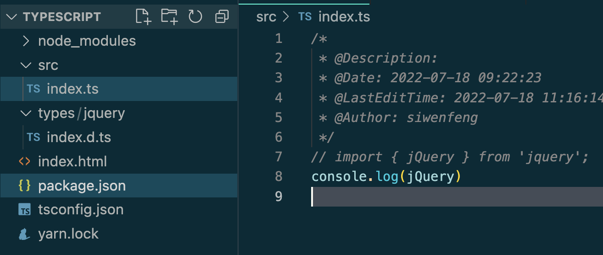

package.json

```json
{
  "name": "typescript",
  "version": "1.0.0",
  "main": "index.js",
  "license": "MIT",
  "scripts": {
    "dev": "vite"
  },
  "devDependencies": {
    "vite": "^3.0.0"
  },
  "dependencies": {
    "jquery": "3.5.1",
    "typescript": "^4.7.4"
  }
}

```

tsconfig.json

```typescript
{
  "compilerOptions": {
    "target": "es5", /* Set the JavaScript language version for emitted JavaScript and include compatible library declarations. */
    /* Modules */
    "module": "commonjs", /* Specify what module code is generated. */
    "rootDir": "./src", /* Specify the root folder within your source files. */
    "baseUrl": "./", /* Specify the base directory to resolve non-relative module names. */
    "paths": {
      "*": [
        "types/*"
      ]
    }, /* Specify a set of entries that re-map imports to additional lookup locations. */                                 /* Specify a file that bundles all outputs into one JavaScript file. If `declaration` is true, also designates a file that bundles all .d.ts output. */
    "outDir": "./dist", /* Specify an output folder for all emitted files. */
    "esModuleInterop": true, /* Emit additional JavaScript to ease support for importing CommonJS modules. This enables `allowSyntheticDefaultImports` for type compatibility. */
    // "preserveSymlinks": true,                         /* Disable resolving symlinks to their realpath. This correlates to the same flag in node. */
    "forceConsistentCasingInFileNames": true, /* Ensure that casing is correct in imports. */
    /* Type Checking */
    "strict": true, /* Enable all strict type-checking options. */
    "skipLibCheck": true /* Skip type checking all .d.ts files. */
  },
  "include": [
    "src/**/*",
    "types/**/*"
  ],
  "exclude": [
    "node_modules",
    "**/*.spec.ts"
  ]
}
```

```html
<!DOCTYPE html>
<html lang="en">
<head>
  <meta charset="UTF-8">
  <meta http-equiv="X-UA-Compatible" content="IE=edge">
  <meta name="viewport" content="width=device-width, initial-scale=1.0">
  <title>Document</title>
  <script src="https://cdn.bootcdn.net/ajax/libs/jquery/3.6.0/jquery.js"></script>
</head>
<body>
  <div id="root"></div>
  <script type="module" src="./src/index.ts"></script>
</body>
</html>
```

index.d.ts

```typescript

declare let jQuery: (p: string) => any;

```

index.ts

```typescript
console.log(jQuery)
```

目录结构

