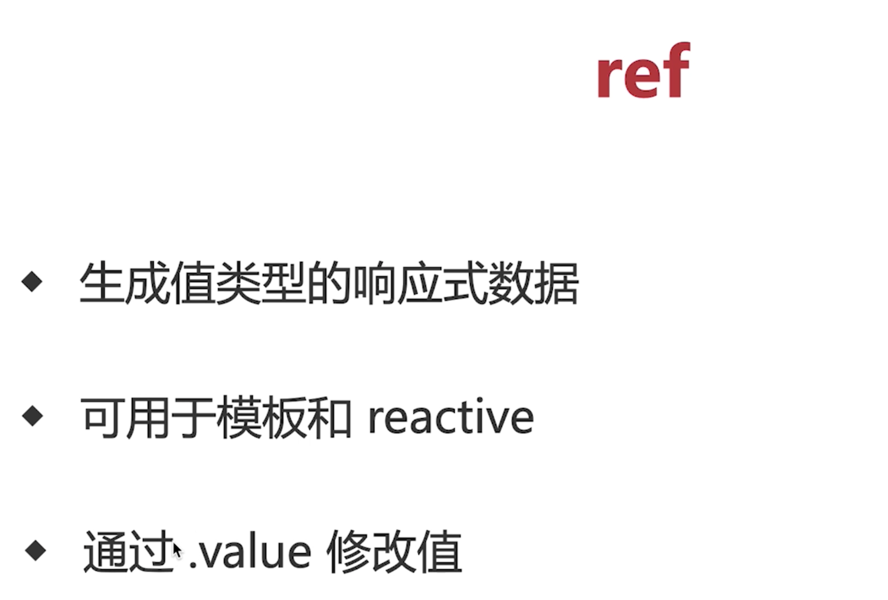
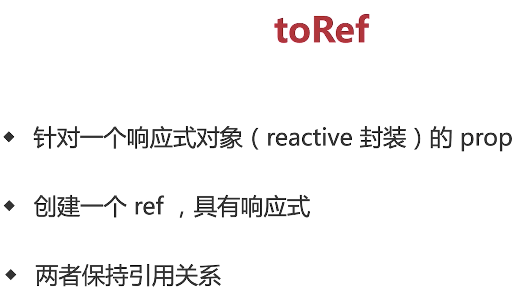
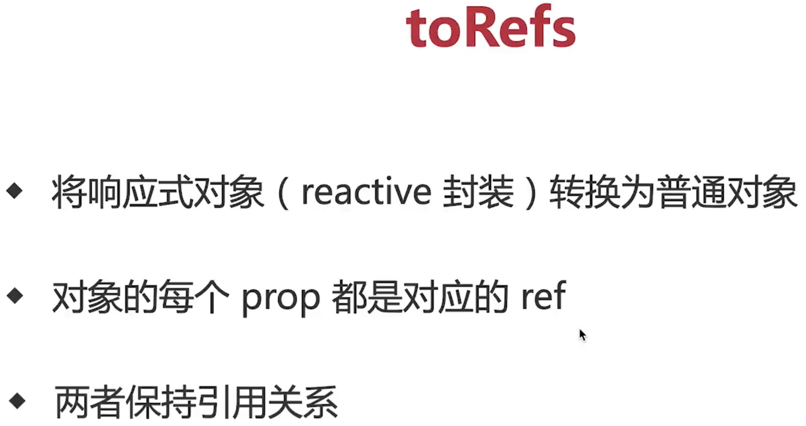
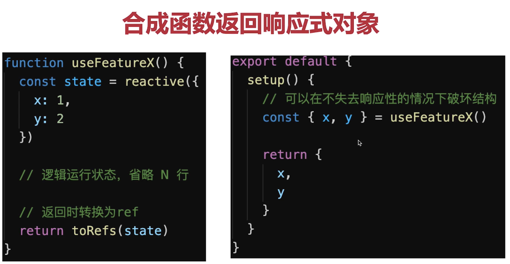
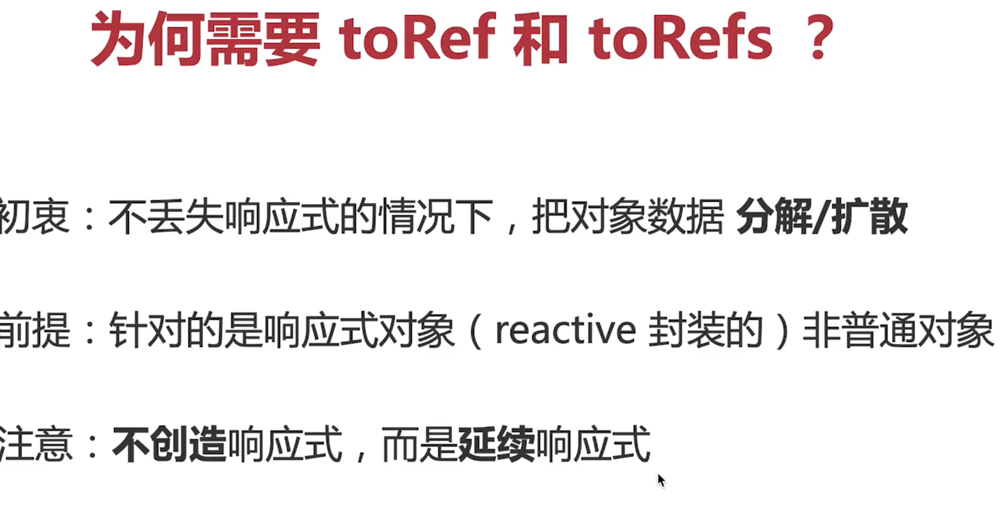

```vue
<template>
  <div>{{ state.name }}</div>
  <div>{{ ageRef }}</div>
  <div ref="domRef">domRef</div>
</template>
<script lang="ts">
import { onBeforeMount, onMounted, onBeforeUpdate, onUpdated, onBeforeUnmount, onUnmounted, ref, reactive, toRef, toRefs } from "vue";
export default {
  setup() {
    const nameRef = ref('name');
    const ageRef = ref(23);
    const domRef = ref(null); // 获取dom节点
    
    const state = reactive({
      name: nameRef
    })
    onMounted(() => {
      console.log(domRef.value)
    })

    setTimeout(() => {
      // 修改state.name nameRef.value 的值也会改变
      // 同理nameRef.value state.name 也会变 双向的
      state.name = 'hh'
      ageRef.value = 1000
    }, 2000)
    return {
      state,
      ageRef,
      domRef
    }
  }
}

</script>
```



## 双向引用关系 toref 非响应式对象即不是reactive 他不是响应式的

```vue
<!--
 * @Description: 
 * @Date: 2022-08-04 18:28:35
 * @LastEditors: siwenfeng
 * @LastEditTime: 2022-08-04 22:56:01
-->
<template>
  <div>
    {{ state.name }} {{state.age}} {{ageRef}}
  </div>
</template>
<script lang="ts">
import { onBeforeMount, onMounted, onBeforeUpdate, onUpdated, onBeforeUnmount, onUnmounted, ref, reactive, toRef, toRefs } from "vue";
export default {
  setup() {

    const state = reactive({
      name: 'siwenfeng',
      age: 24
    })
   // 如果是下面这种 只是数据改变 视图不变 不是响应式的
   // const state = {
   //   name: 'siwenfeng',
   //   age: 24
   // }

    const ageRef = toRef(state, 'age')

    setTimeout(() => {
      state.age = 0
    }, 2000)

    setTimeout(() => {
      ageRef.value = 18
    }, 4000)

    
    
    return {
      state,
      ageRef
    }
  }
}

</script>
```





