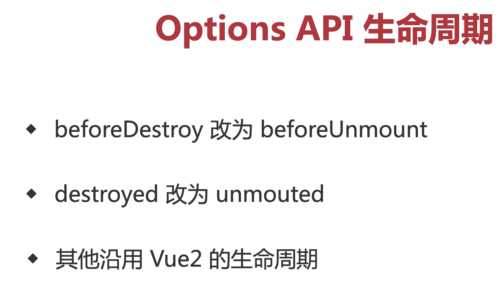

```vue
<!--
 * @Description: 
 * @Date: 2022-08-04 18:28:35
 * @LastEditors: siwenfeng
 * @LastEditTime: 2022-08-04 22:00:10
-->
<template>
  <div>{{ text }}</div>
</template>
<script lang="ts">
import { onBeforeMount, onMounted, onBeforeUpdate, onUpdated, onBeforeUnmount, onUnmounted, } from "vue";
export default {
  props: ['text'],
  setup() {
    console.log('setup')
    onBeforeMount(() => {
      console.log('onBeforeMount')
    });
    onMounted(() => {
      console.log('onMounted')
    });
    onBeforeUpdate(() => {
      console.log('onBeforeUpdate')
    });
    onUpdated(() => {
      console.log('onUpdated')
    });
    onBeforeUnmount(() => {
      console.log('onBeforeUnmount')
    });
    onUnmounted(() => {
      console.log('onUnmounted')
    });
  },
  beforeCreate() {
    console.log('beforecreate')
  },
  created() {
    console.log('created')
  },
  beforeMount() {
    console.log('beforeMount')
  },
  mounted() {
    console.log('mounted')
  },
  beforeUpdate() {
    console.log('beforeUpdate')
  },
  updated() {
    console.log('updated')
  },
  // beforedestroy 替换成了
  beforeUnmount() {
    console.log('beforeUnmount')
  },
  // destroy 替换成了下面
  unmounted() {
    console.log('unmounted')
  },
}

</script>
```


### 更好的代码组织

vue2 逻辑太分散 不太好排查 又是computed watch 


### 更好的类型推导


this.methods.fn 虽然 他帮你merge options了


