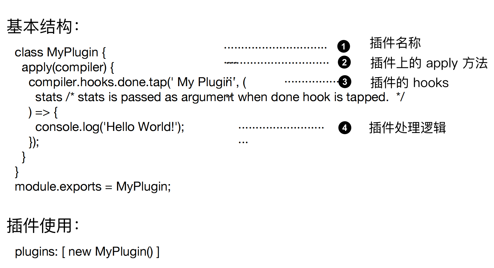

### 一个最简单的 loader 代码结构 

定义：loader 只是一个导出为函数的 JavaScript 模块

`module.exports = function(source) {` 

​	`return source;` 

`};`

### 多 Loader 时的执行顺序

多个 Loader 串行执行 

顺序从后到前

```js
    module.exports = {
        entry: './src/index.js',
        output: {
            filename: 'bundle.js',
            path: path.resolve(__dirname, 'dist')
        },
        module: {
            rules: [{
                test: /\.less$/,
                use: [
                  'style-loader',
                  'css-loader',
                  'less-loader'
                ]
            }]
        }
    };

```

## 函数组合的两种情况 

Unix 中的 pipline 

Compose(webpack采取的是这种) 

compose = (f, g) => (...args) => f(g(...args)); // 从右到左

## loader-runner 介绍

定义：loader-runner 允许你在不安装 webpack 的情 

况下运行 loaders 

作用：

·作为 webpack 的依赖，webpack 中使用它执行 loader 

·进行 loader 的开发和调试

## loader-runner 的使用

```js
    import { runLoaders } from "loader-runner";
    runLoaders({
        resource: “ /abs/path / to / file.txt ? query”, // String: 资源的绝对路径(可以增加查询字符串) 
        loaders: [“/abs/path / to / loader.js ? query”], // String[]: loader 的绝对路径(可以增加查询字符串) 
        context: { minimize: true }, // 基础上下文之外的额外 loader 上下文 
        readResource: fs.readFile.bind(fs) // 读取资源的函数
    }, function(err, result) {
        // err: Error? 
        // result.result: Buffer | String 
    })
```


## loader 的参数获取 

通过 loader-utils 的 getOptions 方法获取 

const loaderUtils = require("loader-utils"); 

module.exports = function(content) { 

const { name } = loaderUtils.getOptions(this); 

};


## loader 异常处理 

loader 内直接通过 throw 抛出 

通过 this.callback 传递错误 

this.callback( 

err: Error | null, 

content: string | Buffer, 

sourceMap?: SourceMap, 

meta?: any 

);

## loader 的异步处理

通过 this.async 来返回一个异步函数 

·第一个参数是 Error，第二个参数是处理的结果 

示意代码： 

module.exports = function(input) { 

const callback = this.async(); 

// No callback -> return synchronous results 

// if (callback) { ... } 

callback(null, input + input); 

};

## 在 loader 中使用缓存

webpack 中默认开启 loader 缓存 

·可以使用 this.cacheable(false) 关掉缓存 

缓存条件： loader 的结果在相同的输入下有确定的输出 

·有依赖的 loader 无法使用缓存


## loader 如何进行文件输出？ 

通过 this.emitFile 进行文件写入 

const loaderUtils = require("loader-utils"); 

module.exports = function(content) { 

const url = loaderUtils.interpolateName(this, "[hash].[ext]", { 

content, 

}); 

this.emitFile(url, content); 

const path = `__webpack_public_path__ + ${JSON.stringify(url)};`; 

return `export default ${path}`; 

};


## 实战开发一个自动合成雪碧图的 loader 

支持的语法： 

background: url('a.png?__sprite'); 

background: url('sprite.png'); 

background: url('b.png?__sprite');


## 准备知识：如何将两张图片合成一张图片？ 

使用 spritesmith (https://www.npmjs.com/package/spritesmith) 

spritesmith 使用示例 

const sprites = ['./images/1.jpg', './images/2.jpg']; 

Spritesmith.run({src: sprites}, function handleResult (err, result) { 

result.image; 

result.coordinates; 

result.properties; 

});

## 插件的运行环境 

插件没有像 loader 那样的独立运行环境 

只能在 webpack 里面运行

## 插件的基本结构



## 搭建插件的运行环境 

const path = require("path"); 

const DemoPlugin = require("./plugins/demo-plugin.js"); 

const PATHS = { 

lib: path.join(__dirname, "app", "shake.js"), 

build: path.join(__dirname, "build"), 

};

module.exports = { 

entry: { 

lib: PATHS.lib, 

},

output: { 

path: PATHS.build, 

filename: "[name].js", 

},

plugins: [new DemoPlugin()], 

};

## 开发一个最简单的插件 

src/demo-plugin.js 

module.exports = class DemoPlugin { 

constructor(options) { 

this.options = options; 

}

apply() { 

console.log("apply", this.options); 

} 

};

加入到 webpack 配置中 

module.exports = { 

... 

plugins: [new DemoPlugin({ name: "demo" })] 

};

## 插件中如何获取传递的参数？ 

通过插件的构造函数进行获取 

module.exports = class MyPlugin { 

constructor(options) { 

this.options = options; 

}

apply() { 

console.log("apply", this.options); 

} 

};