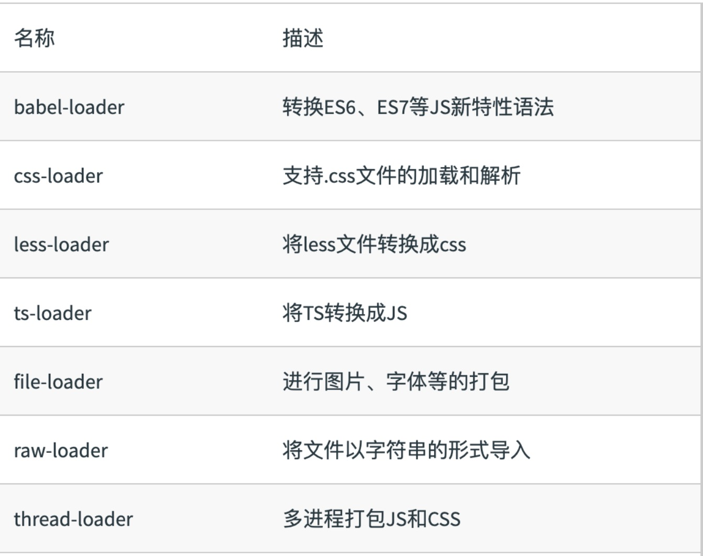
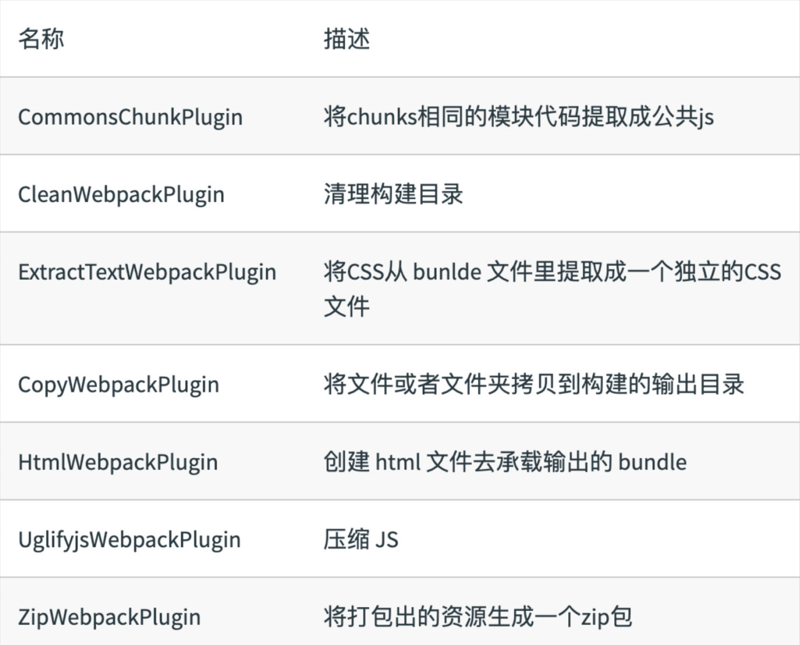
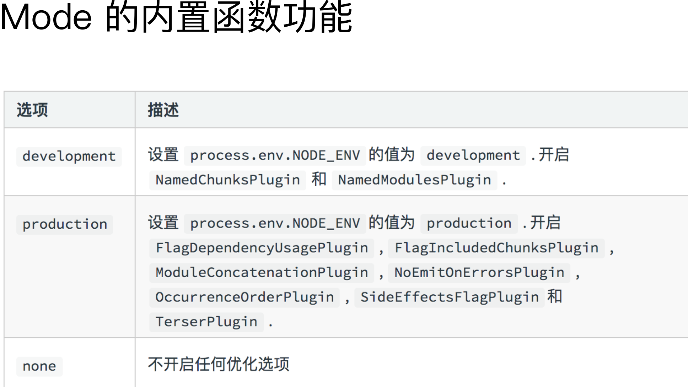
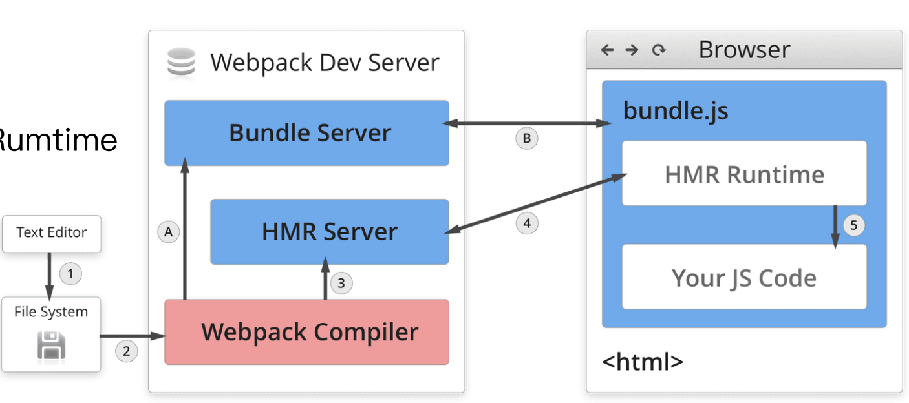
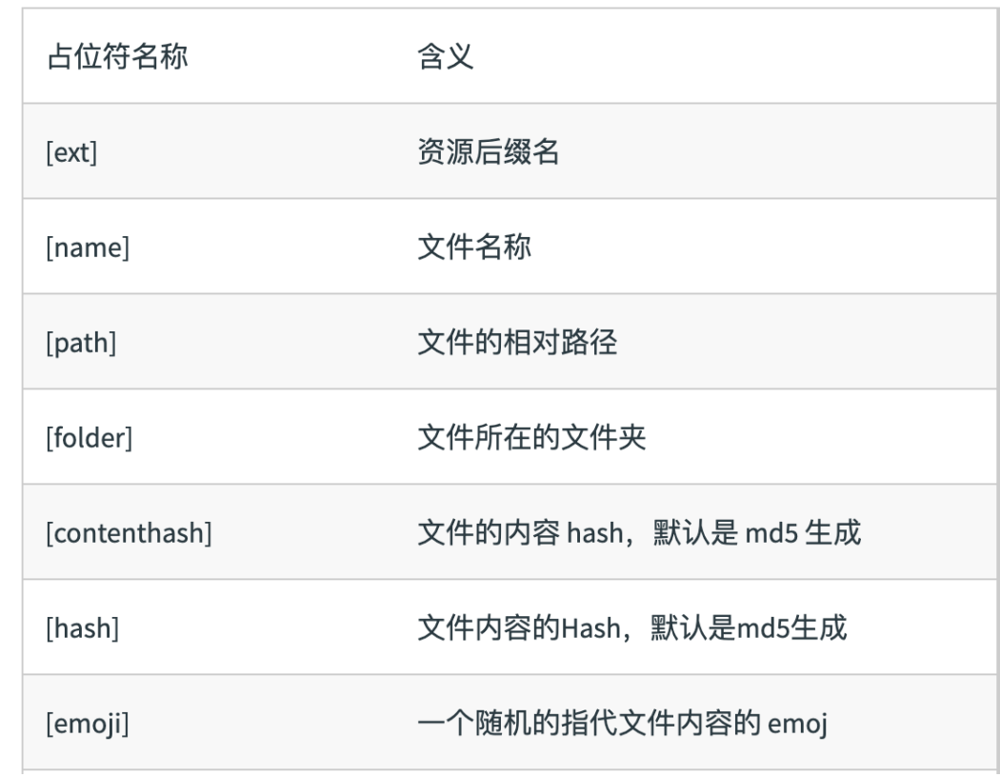

## 为什么需要构建⼯具？

- 转换 ES6 语法
- 转换 JSX
- 压缩混淆
- ES6 module 主流浏览器⽀持情况 
- 图⽚压缩
- CSS 前缀补全/预处理器


初识 webpack：webpack 配置组成

```js
module.exports = {
  entry: './src/index.js',
  output: './dist/main.js',
  mode: 'production',

  module: {
  rules: [

    { test: /\.txt$/, use: 'raw-loader' }

    ]
  },
  plugins: [
    new HtmlwebpackPlugin({
    template: './src/index.html’

    })
  ]
};
```

## Entry 的⽤法

```js
module.exports = {

	entry: './path/to/my/entry/file.js'

};

//单⼊⼝：entry 是⼀个字符串 

//多⼊⼝：entry 是⼀个对象

module.exports = {
  entry: {
    app: './src/app.js',
    adminApp: './src/adminApp.js'
  }
};
```

## Output 的⽤法：单⼊⼝配置

```js
module.exports = {
  entry: './path/to/my/entry/file.js'
  output: {
    filename: 'bundle.js’,
    path: __dirname + '/dist'
  }
};
```

## Output 的⽤法：多⼊⼝配置

```js
module.exports = {
  entry: {
    app: './src/app.js',
    search: './src/search.js'
  },
  output: {
    filename: '[name].js', // 确保文件唯一
    path: __dirname + '/dist'
  }
};
```


## Loaders

webpack 开箱只支持JS和JSON两种文件类型，通过loaders去支持其他文件类型并把他们转成有效的模块，并且可以添加到依赖图中。

本身是一个函数，接受源文件作为参数，返回转换的结果。



## Loaders 的⽤法

```js
const path = require('path');
module.exports = {
  output: {
    filename: 'bundle.js'
  },
  module: {
    rules: [
      { test: /\.txt$/, use: 'raw-loader' } // test指定匹配规则，use指定loader名称 
    ]
  }
}
```

## 核⼼概念之 Plugins

插件⽤于 bundle ⽂件的优化，资源管理和环境变量注⼊

作⽤于整个构建过程



## Plugins 的⽤法

```js
const path = require('path');

module.exports = {
  output: {
    filename: 'bundle.js'
  },
  plugins: [
    new HtmlWebpackPlugin({template: 
    './src/index.html'})
    ]
};
```

## 核⼼概念之 Mode

Mode ⽤来指定当前的构建环境是：production、development 还是 none

设置 mode 可以使⽤ webpack 内置的函数，默认值为 production



## 资源解析：解析 ES6

使⽤ babel-loader

babel的配置⽂件是：.babelrc

```js
const path = require('path');
module.exports = {
	entry: './src/index.js',
  output: {
    filename: 'bundle.js',
    path: path.resolve(__dirname, 'dist')
  },
  + module: {
  + rules: [
  + {
  + test: /\.js$/,
  + use: 'babel-loader'
  + }
  + ]
  + }
};
```

## 资源解析：增加ES6的babel preset配置

```js
{
  "presets": [
    "@babel/preset-env”
  ],

	"plugins": [
		"@babel/proposal-class-properties"
	] 
}
```

## 资源解析：解析 React JSX

```js
{

"presets": [
	"@babel/preset-env",
+	"@babel/preset-react"
	],

"plugins": [
+	"@babel/proposal-class-properties"
	] 
}
```

## 资源解析：解析 CSS

css-loader ⽤于加载 .css ⽂件，并且转换成 commonjs 对象

style-loader 将样式通过 <style> 标签插⼊到 head 中

```js
const path = require('path');
module.exports = {
entry: './src/index.js',
output: {
filename: 'bundle.js',
path: path.resolve(__dirname, 'dist')
},
+ module: {
+ rules: [
+ {
+ test: /\.css$/,
+ use: [
+ 'style-loader',
+ 'css-loader'
+ ]
+ }
+ ]
+ }
};
```

## 资源解析：解析 Less 和 SaSS

less-loader ⽤于将 less 转换成 css

```js
const path = require('path');
module.exports = {
entry: './src/index.js',
output: {
filename: 'bundle.js',
path: path.resolve(__dirname, 'dist')
},
+ module: {
+ rules: [
+ {
+ test: /\.less$/,
+ use: [
+ 'style-loader',
+ 'css-loader',
+ ' less-loader'
+ ]
+ }
+ ]
+ }
};
```

## 资源解析：解析图⽚

file-loader ⽤于处理⽂件

```js
const path = require('path');
module.exports = {
entry: './src/index.js',
output: {
filename: 'bundle.js',
path: path.resolve(__dirname, 'dist')
},
module: {
rules: [
+ {
+ test: /\.(png|svg|jpg|gif)$/,
+ use: [
+ 'file-loader'
+ ]
+ }
]}
};
```

## 资源解析：解析字体

file-loader 也可以⽤于处理字体

```js
const path = require('path');
module.exports = {
entry: './src/index.js',
output: {
filename: 'bundle.js',
path: path.resolve(__dirname, 'dist')
},
module: {
rules: [
+ {
+ test: /\.(woff|woff2|eot|ttf|otf)$/,
+ use: [
+ 'file-loader'
+ ]
+ }
]}
};
```

## 资源解析：使⽤ url-loader

url-loader 也可以处理图⽚和字体

可以设置较⼩资源⾃动 base64

```js
const path = require('path');
module.exports = {
entry: './src/index.js',
output: {
filename: 'bundle.js',
path: path.resolve(__dirname, 'dist')
},
module: {
rules: [
+ {
+ test: /\.(png|svg|jpg|gif)$/,
+ use: [{ + loader: 'url-loader’, 
+ options: { 
+ limit: 10240 
+ } 
+ }] 
+ }
]}
};
```

## webpack 中的⽂件监听

⽂件监听是在发现源码发⽣变化时，⾃动重新构建出新的输出⽂件。

webpack 开启监听模式，有两种⽅式：

- ·启动 webpack 命令时，带上 --watch 参数
- ·在配置 webpack.config.js 中设置 watch: true

唯⼀缺陷：每次需要⼿动刷新浏览器

```js
{
  "name": "hello-webpack",
  "version": "1.0.0",
  "description": "Hello webpack",
  "main": "index.js",
  "scripts": {
  "build": "webpack ",
  + "watch": "webpack"
  },
  "keywords": [],
  "author": "",
  "license": "ISC"
}
```

## ⽂件监听的原理分析

轮询判断⽂件的最后编辑时间是否变化

某个⽂件发⽣了变化，并不会⽴刻告诉监听者，⽽是先缓存起来，等 aggregateTimeout

```js
module.export = {
    //默认 false，也就是不开启
    watch: true,
    //只有开启监听模式时，watchOptions才有意义
    wathcOptions: {
    //默认为空，不监听的文件或者文件夹，支持正则匹配
    ignored: /node_modules/,
    //监听到变化发生后会等300ms再去执行，默认300ms
    aggregateTimeout: 300,
    //判断文件是否发生变化是通过不停询问系统指定文件有没有变化实现的，默认每秒问1000次
    poll: 1000
  } 
}
```

## 热更新：webpack-dev-server

- WDS 不刷新浏览器
- WDS 不输出⽂件，⽽是放在内存中
- 使⽤ HotModuleReplacementPlugin插件

```js
{
  "name": "hello-webpack",
  "version": "1.0.0",
  "description": "Hello webpack",
  "main": "index.js",
  "scripts": {
  "build": "webpack ",
  + ”dev": "webpack-dev-server --open"
  },
  "keywords": [],
  "author": "",
  "license": "ISC"
}
```

## 热更新：使⽤ webpack-dev-middleware

WDM 将 webpack 输出的⽂件传输给服务器

适⽤于灵活的定制场景

```js
const express = require('express');
const webpack = require('webpack');
const webpackDevMiddleware = require('webpack-dev-middleware');
const app = express();
const config = require('./webpack.config.js');
const compiler = webpack(config);

app.use(webpackDevMiddleware(compiler, {
	publicPath: config.output.publicPath
}));

app.listen(3000, function () {
	console.log('Example app listening on port 3000!\n');
});
```

## 热更新的原理分析

Webpack Compile: 将 JS 编译成 Bundle

HMR Server: 将热更新的⽂件输出给 HMR Rumtime

Bundle server: 提供⽂件在浏览器的访问

HMR Rumtime: 会被注⼊到浏览器，

更新⽂件的变化

bundle.js: 构建输出的⽂件



## 什么是⽂件指纹？

打包后输出的⽂件名的后缀


## ⽂件指纹如何⽣成

**Hash**：和整个项⽬的构建相关，只要项⽬⽂件有修改，整个项⽬构建的 hash 值就会更改

**Chunkhash**：和 webpack 打包的 chunk 有关，不同的 entry 会⽣成不同的 chunkhash 值

**Contenthash**：根据⽂件内容来定义 hash ，⽂件内容不变，则 contenthash 不变


## JS 的⽂件指纹设置

设置 output 的 filename，使⽤ [chunkhash]

```js
module.exports = {
  entry: {
    app: './src/app.js',
    search: './src/search.js'
  },
  output: {
    + filename: '[name][chunkhash:8].js',
    path: __dirname + '/dist'
  }
};
```

## CSS 的⽂件指纹设置

设置 MiniCssExtractPlugin 的 filename，

使⽤ [contenthash]

```js
module.exports = {
  entry: {
    app: './src/app.js',
    search: './src/search.js'
  },
  output: {
    filename: '[name][chunkhash:8].js',
    path: __dirname + '/dist'
  },
  plugins: [
    + new MiniCssExtractPlugin({ 
    + filename: `[name][contenthash:8].css
    + });
  ]
};
```

## 图⽚的⽂件指纹设置

设置 file-loader 的 name，使⽤ [hash]




```js
const path = require('path');
module.exports = {
	entry: './src/index.js',
	output: {
		filename: 'bundle.js',
		path: path.resolve(__dirname, 'dist')
	},
	module: {
	rules: [
		{
		test: /\.(png|svg|jpg|gif)$/,
		use: [{
		loader: 'file-loader’,
		+ options: {
		+ name: 'img/[name][hash:8].[ext]'
		+ } }] }]}
};  
```

## 代码压缩

HTML 压缩 html-webpack-plugin，

CSS 压缩 optimize-css-assets-webpack-plugin 同时使⽤ cssnano

JS 压缩 内置了 uglifyjs-webpack-plugin


## html ⽂件的压缩

```js
module.exports = {
entry: {
app: './src/app.js',
search: './src/search.js'
},
output: {
filename: '[name][chunkhash:8].js',
path: __dirname + '/dist'
},
plugins: [
+ new HtmlWebpackPlugin({
+ template: path.join(__dirname, 'src/search.html’),
+ filename: 'search.html’, + chunks: ['search’],
+ inject: true,
+ minify: {
+ html5: true,
+ collapseWhitespace: true,
+ preserveLineBreaks: false,
+ minifyCSS: true,
+ minifyJS: true,
+ removeComments: false
+ } + })
]
};
```

## CSS ⽂件的压缩

```js
module.exports = {
entry: {
app: './src/app.js',
search: './src/search.js'
},
output: {
filename: '[name][chunkhash:8].js',
path: __dirname + '/dist'
},
plugins: [
+ new OptimizeCSSAssetsPlugin({
+ assetNameRegExp: /\.css$/g,
+ cssProcessor: require('cssnano’) + })
]
};
```


