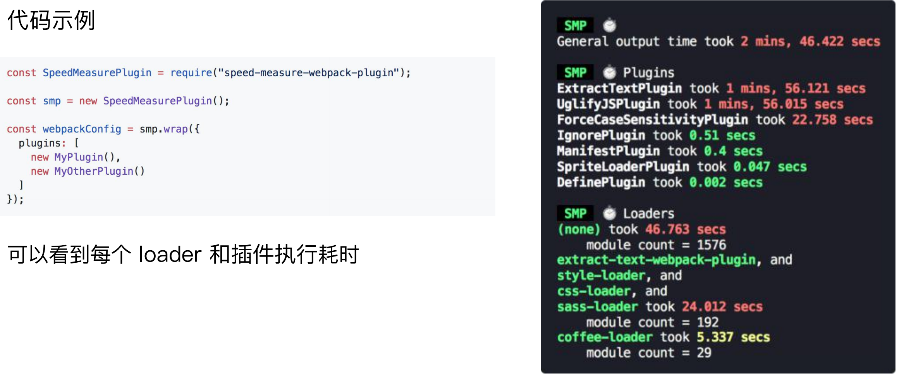
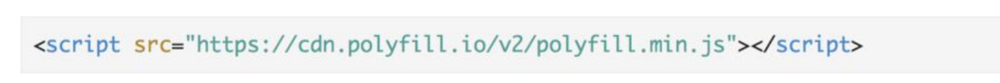

## 速度分析：使用 speed-measure-webpack-plugin



## webpack-bundle-analyzer 分析体积


## 使用高版本webpack

V8 带来的优化（

for of 替代 forEach、Map 和 Set 替代 Object、includes 替代 indexOf） 

默认使用更快的 md4 hash 算法

webpacks AST 可以直接从 loader 传递给 AST，减少解析时间 

使用字符串方法替代正则表达式  

## 多进程/多实例构建：资源并行解析可选方案

thread-loader 配合

- happy-pack
- parallel-webpack

## 多进程/多实例：使用 HappyPack 解析资源

原理：每次 webapck 解析一个模块，HappyPack 会将它及它的依赖分配给 worker 线程中


## 多进程/多实例：使用 thread-loader 解析资源

原理：每次 webpack 解析一个模块，thread- loader 会将它及它的依赖分配给 worker 线程中

```js
{
  test: /.js$/,
    use: [
      {
           loader: 'thread-loader',
           options: {
               workers: 3
           }
       },
       'babel-loader',
    ]
},
```

## 多进程/多实例：并行压缩

webpack默认：terser-webpack-plugin 开启 parallel 参数

```js
    optimization: {
        minimizer: [
            new TerserPlugin({
                parallel: true,
                cache: true
            })
        ]
    }
```

## 分包：设置 Externals 

思路：将 react、react-dom 基础包通过 

cdn 引入，不打入 bundle 中

方法：使用 html-webpack-externals-plugin

缺点：会生成多个cdn链接, splitchunk 也不是最佳， 最好使用dllplugin


```js
const HtmlWebpackExternalsPlugin = require('html-webpack-externals-plugin');
    plugins: [

        new HtmlWebpackExternalsPlugin({
            externals: [
              {
                module: 'react',
                entry: 'https://11.url.cn/now/lib/16.2.0/react.min.js',
                global: 'React',
              },
              {
                module: 'react-dom',
                entry: 'https://11.url.cn/now/lib/16.2.0/react-dom.min.js',
                global: 'ReactDOM',
              },
            ]
        }),
    ]
```

## 进一步分包：预编译资源模块

思路：将 react、react-dom、redux、react-redux 

基础包和业务基础包打包成一个文件

方法：使用 DLLPlugin 进行分包，DllReferencePlugin 

对 manifest.json 引用


webpack.dll.js

```js

const path = require('path');
const webpack = require('webpack');

module.exports = {
    entry: {
        library: [
            'react',
            'react-dom'
        ]
    },
    output: {
        filename: '[name]_[chunkhash].dll.js',
        path: path.join(__dirname, 'build/library'),
        library: '[name]'
    },
    plugins: [
        new webpack.DllPlugin({
            name: '[name]_[hash]',
            path: path.join(__dirname, 'build/library/[name].json')
        })
    ]
};
```

```js
  new webpack.DllReferencePlugin({
      manifest: require('./build/library/library.json')
  }),
```

webpack.config.js plugins需要引入

## 缓存

目的：提升二次构建速度


缓存思路： 

· babel-loader 开启缓存 

```js
new HappyPack({
	loaders: [ 'babel-loader?cacheDirectory=true' ]
}),
```

· terser-webpack-plugin 开启缓存 

```js
new TerserPlugin({
                 parallel: true,
                 cache: true
            })
```

· 使用 cache-loader 或者 hard-source-webpack-plugin

```js
rules: [
            {
                test: /.js$/,
                use: [
                    'cache-loader',
                ]
            }
        ]
```

```js
const HardSourceWebpackPlugin = require('hard-source-webpack-plugin');

plugins: [  new HardSourceWebpackPlugin() ]
```


## 缩小构建目标 

目的：尽可能的少构建模块 

比如 babel-loader 不解析 node_modules

```js
{
  test: /.js$/,
  exclude: 'node_modules',
  include: path.resolve('src'),
},
```

## 图片压缩

使用：配置 image-webpack-loader

## 减少文件搜索范围

优化 resolve.modules 配置（减少模块搜索层级）

优化 resolve.mainFields 配置

优化 resolve.extensions 配置

合理使用 alias

```js
    resolve: {
        alias: {
          'react':path.resolve(__dirname,'./node_modules/react/umd/react.production.min.js'),
           'react-dom': path.resolve(__dirname, './node_modules/react-dom/umd/react-dom.production.min.js'),
        },
        extensions: ['.js'],
        mainFields: ['main']
    }
```

## 无用的 CSS 如何删除掉？

PurifyCSS: 遍历代码，识别已经用到的 CSS class 

uncss: HTML 需要通过 jsdom 加载，所有的样式通过PostCSS解析，通过 

document.querySelector 来识别在 html 文件里面不存在的选择器

```js
npm i purgecss-webpack-plugin -D

const path = require('path')
const glob = require('glob')
const MiniCssExtractPlugin = require('mini-css-extract-plugin')
const PurgeCSSPlugin = require('purgecss-webpack-plugin')

const PATHS = {
  src: path.join(__dirname, 'src')
}

module.exports = {
  entry: './src/index.js',
  output: {
    filename: 'bundle.js',
    path: path.join(__dirname, 'dist')
  },
  optimization: {
    splitChunks: {
      cacheGroups: {
        styles: {
          name: 'styles',
          test: /\.css$/,
          chunks: 'all',
          enforce: true
        }
      }
    }
  },
  module: {
    rules: [
      {
        test: /\.css$/,
        use: [
          MiniCssExtractPlugin.loader,
          "css-loader"
        ]
      }
    ]
  },
  plugins: [
    new MiniCssExtractPlugin({
      filename: "[name].css",
    }),
    new PurgeCSSPlugin({
      // paths: glob.sync(`${PATHS.src}/**/*`,  { nodir: true }),
     	// 可以换成熟悉的用法
     	 paths: glob.sync(path.join(__dirname, 'index.html')),
    })
    }),
  ]
}

```

## 构建体积优化：动态 Polyfill

Polyfill Service原理

识别 User Agent，下发不同的 Polyfil


## 构建体积优化：如何使用动态 Polyfill service

polyfill.io 官方提供的服务 



基于官方自建 polyfill 服务

//huayang.qq.com/polyfill_service/v2/polyfill.min.js?unknown=polyfill&features=Promise,Map,Set


## 体积优化策略总结 

Scope Hoisting 

Tree-shaking 

公共资源分离 

图片压缩 

动态 Polyfill
