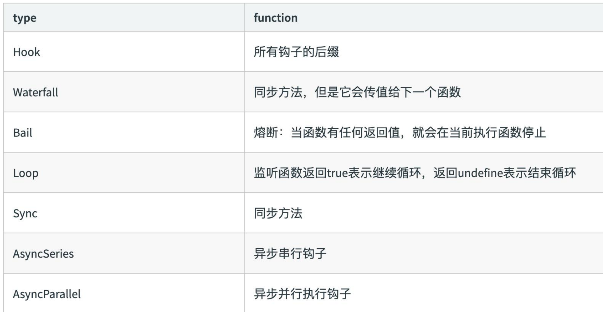
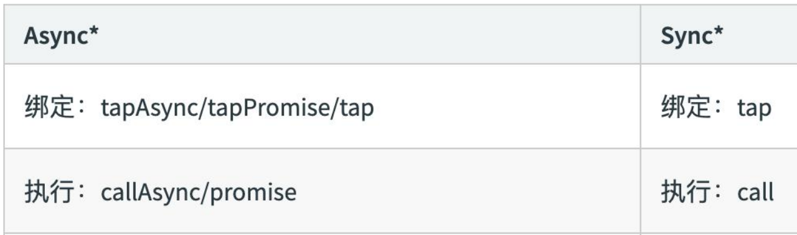
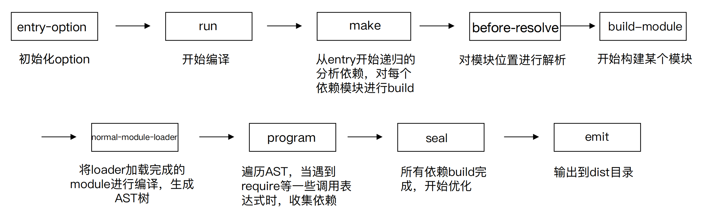
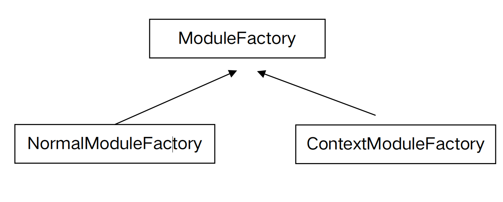
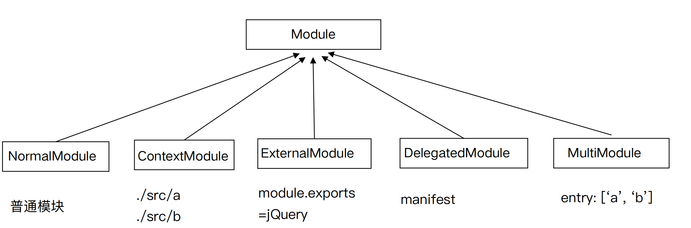

## Tapable 是什么？

Tapable 是一个类似于 Node.js 的 EventEmitter 的库, 主要是控制钩子函数的发布 

与订阅,控制着 webpack 的插件系统。 

Tapable库暴露了很多 Hook（钩子）类，为插件提供挂载的钩子 

```js
const { 

SyncHook, //同步钩子 

SyncBailHook, //同步熔断钩子 

SyncWaterfallHook, //同步流水钩子 

SyncLoopHook, //同步循环钩子 

AsyncParallelHook, //异步并发钩子 

AsyncParallelBailHook, //异步并发熔断钩子 

AsyncSeriesHook, //异步串行钩子 

AsyncSeriesBailHook, //异步串行熔断钩子 

AsyncSeriesWaterfallHook //异步串行流水钩子 

} = require("tapable");
```

## Tapable hooks 类型



## Tapable 的使用 -new Hook 新建钩子

Tapable 暴露出来的都是类方法，new 一个类方法获得我们需要的钩子 

class 接受数组参数 options ，非必传。类方法会根据传参，接受同样数量的参数。 

const hook1 = new SyncHook(["arg1", "arg2", "arg3"]);


## Tapable 的使用-钩子的绑定与执行

Tabpack 提供了同步&异步绑定钩子的方法，并且他们都有绑定事件和执行事件对应的方法。



## Tapable 的使用-hook 基本用法示例

```js
const hook1 = new SyncHook(["arg1", "arg2", "arg3"]); 

//绑定事件到webapck事件流 

hook1.tap('hook1', (arg1, arg2, arg3) => console.log(arg1, arg2, arg3)) //1,2,3 

//执行绑定的事件 

hook1.call(1,2,3)
```

## Tapable 的使用-实际例子演示

定义一个 Car 方法，在内部 hooks 上新建钩子。分别是同步钩子 accelerate、 

brake（ accelerate 接受一个参数）、异步钩子 calculateRoutes 

使用钩子对应的绑定和执行方法 

calculateRoutes 使用 tapPromise 可以返回一个 promise 对象


## Tapable 是如何和 webpack 联系起来的？

```js
if (Array.isArray(options)) {
  compiler = new MultiCompiler(options.map((options) => webpack(options)));
} else if (typeof options === "object") {
  options = new WebpackOptionsDefaulter().process(options);
  compiler = new Compiler(options.context);
  compiler.options = options;
  new NodeEnvironmentPlugin().apply(compiler);
  if (options.plugins && Array.isArray(options.plugins)) {
    for (const plugin of options.plugins) {
      if (typeof plugin === "function") {
        plugin.call(compiler, compiler);
      } else {
        plugin.apply(compiler);
      }
    }
  }
  compiler.hooks.environment.call();
  compiler.hooks.afterEnvironment.call();
  compiler.options = new WebpackOptionsApply().process(options, compiler);
}

```

## 模拟 Compiler.js

```js
    module.exports = class Compiler {
        constructor() {
            this.hooks = {
                accelerate: new SyncHook(['newspeed']),
                brake: new SyncHook(),
                calculateRoutes: new AsyncSeriesHook(["source", "target", "routesList"])
            }
        }
        run() {
            this.accelerate(10) this.break() this.calculateRoutes('Async', 'hook', 'demo')
        }
        accelerate(speed) {
            this.hooks.accelerate.call(speed);
        }
        break () {
            this.hooks.brake.call();
        }
        calculateRoutes() {
            this.hooks.calculateRoutes.promise(...arguments).then(() => {}, err => { 										console.error(err); });
        }
    }
```

## 插件 my-plugin.js

```js
const Compiler = require('./Compiler')
class MyPlugin {
        constructor() {}
        apply(compiler) {
           compiler.hooks.brake.tap("WarningLampPlugin", () => 												console.log('WarningLampPlugin'));
            compiler.hooks.accelerate.tap("LoggerPlugin", newSpeed => 			console.log(`Accelerating to ${newSpeed}`));
            compiler.hooks.calculateRoutes.tapPromise("calculateRoutes tapAsync", (source, target, routesList) => {
                return new Promise((resolve, reject) => {
                    setTimeout(() => {
                        console.log(`tapPromise to ${source} ${target} ${routesList}`)
                        resolve();
                    }, 1000)
                });
            });
        }
    }
```

## 模拟插件执行 

```js
const myPlugin = new MyPlugin();
const options = {
   plugins: [myPlugin]
 }
const compiler = new Compiler();
for (const plugin of options.plugins) {
     if (typeof plugin === "function") {
          plugin.call(compiler, compiler);
        } else {
          plugin.apply(compiler);
      }
}

 compiler.run();
```

## webpack的编译都按照下面的钩子调用顺序执行



grep "entryOption" -rn ./node_modules/webpack

## WebpackOptionsApply

将所有的配置 options 参数转换成 webpack 内部插件 

使用默认插件列表 

举例：

·output.library -> LibraryTemplatePlugin 

·externals -> ExternalsPlugin 

·devtool -> EvalDevtoolModulePlugin, SourceMapDevToolPlugin 

·AMDPlugin, CommonJsPlugin 

·RemoveEmptyChunksPlugin

## Compiler hooks

流程相关： 

·(before-)run 

·(before-/after-)compile 

·make 

·(after-)emit 

·done 

监听相关： 

·watch-run 

·watch-close

## Compilation

Compiler 调用 Compilation 生命周期方法 

·addEntry -> addModuleChain 

·finish (上报模块错误) 

·seal

## ModuleFactory



## Module 



## NormalModule 

Build

·使用 loader-runner 运行 loaders 

·通过 Parser 解析 (内部是 acron) 

·ParserPlugins 添加依赖


## Compilation hooks 

### 模块相关： 

·build-module 

·failed-module 

·succeed-module

### 资源生成相关： 

·module-asset 

·chunk-asset

### 优化和 seal相关：

·(after-)seal 

·optimize 

·optimize-modules 

(-basic/advanced) 

·after-optimize-modules 

·after-optimize-chunks 

·after-optimize-tree 

·optimize-chunk-modules 

(-basic/advanced) 

·after-optimize-chunk-modules 

·optimize-module/chunk-order 

·before-module/chunk-ids 

·(after-)optimize-module/ 

chunk-ids 

·before/after-hash


## Chunk 生成算法 

1. webpack 先将 entry 中对应的 module 都生成一个新的 chunk 

2. 遍历 module 的依赖列表，将依赖的 module 也加入到 chunk 中 

3. 如果一个依赖 module 是动态引入的模块，那么就会根据这个 module 创建一个 新的 chunk，继续遍历依赖 

4. 重复上面的过程，直至得到所有的 chunks

## AST 基础知识 

抽象语法树（

abstract syntax tree 或者缩写为 AST），或者语法树（

syntax tree），是 

源代码的抽象语法结构的树状表现形式，这里特指编程语言的源代码。树上的每个节点都 

表示源代码中的一种结构。 

在线demo: https://esprima.org/demo/parse.html


## 动手实现一个简易的 webpack 

可以将 ES6 语法转换成 ES5 的语法 

·通过 babylon 生成AST 

·通过 babel-core 将AST重新生成源码 

可以分析模块之间的依赖关系 

· 通过 babel-traverse 的 ImportDeclaration 方法获取依赖属性 

生成的 JS 文件可以在浏览器中运行