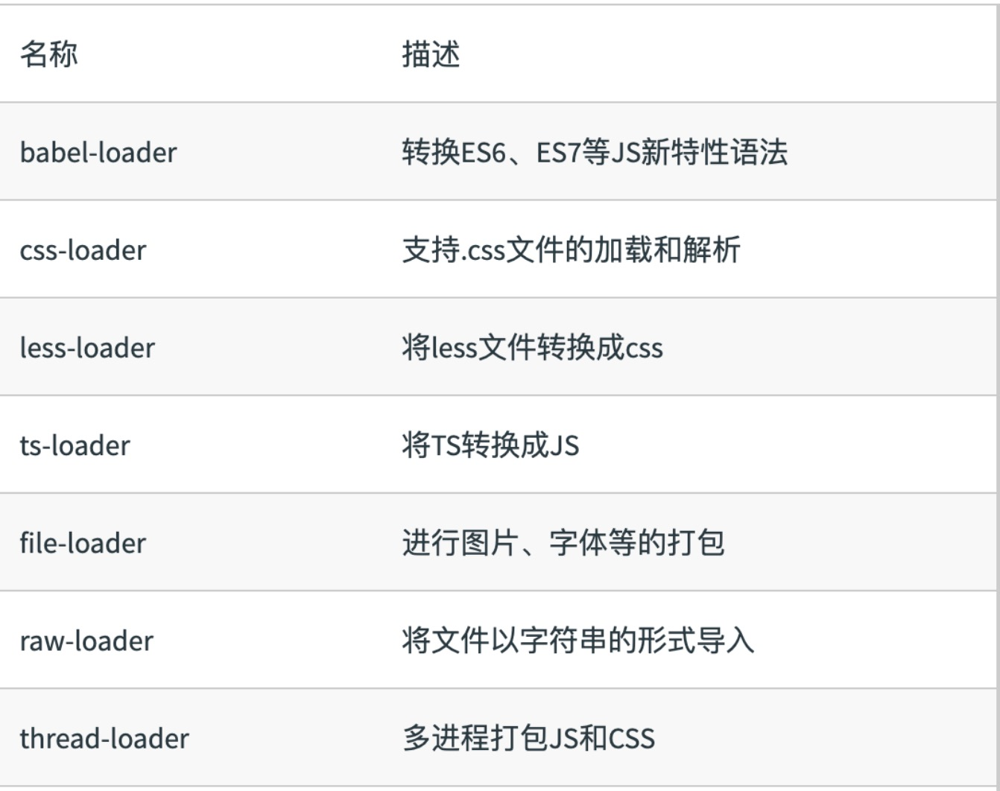
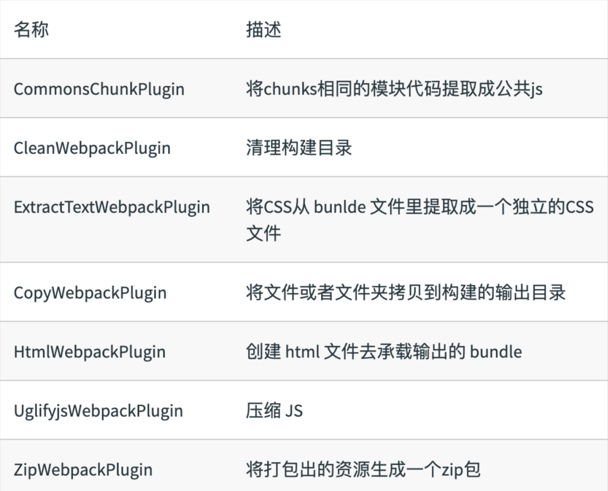
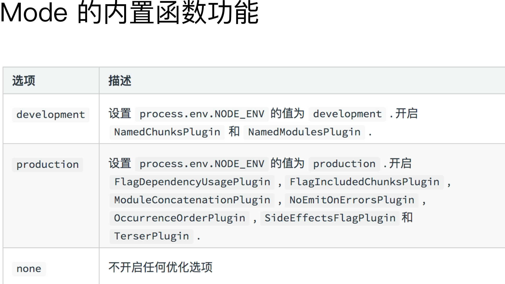

## 为什么需要构建⼯具？

- 转换 ES6 语法
- 转换 JSX
- 压缩混淆
- ES6 module 主流浏览器⽀持情况 
- 图⽚压缩
- CSS 前缀补全/预处理器


初识 webpack：webpack 配置组成

```js
module.exports = {
  entry: './src/index.js',
  output: './dist/main.js',
  mode: 'production',

  module: {
  rules: [

    { test: /\.txt$/, use: 'raw-loader' }

    ]
  },
  plugins: [
    new HtmlwebpackPlugin({
    template: './src/index.html’

    })
  ]
};
```

## Entry 的⽤法

```js
module.exports = {

	entry: './path/to/my/entry/file.js'

};

//单⼊⼝：entry 是⼀个字符串 

//多⼊⼝：entry 是⼀个对象

module.exports = {
  entry: {
    app: './src/app.js',
    adminApp: './src/adminApp.js'
  }
};
```

## Output 的⽤法：单⼊⼝配置

```js
module.exports = {
  entry: './path/to/my/entry/file.js'
  output: {
    filename: 'bundle.js’,
    path: __dirname + '/dist'
  }
};
```

## Output 的⽤法：多⼊⼝配置

```js
module.exports = {
  entry: {
    app: './src/app.js',
    search: './src/search.js'
  },
  output: {
    filename: '[name].js', // 确保文件唯一
    path: __dirname + '/dist'
  }
};
```


## Loaders

webpack 开箱只支持JS和JSON两种文件类型，通过loaders去支持其他文件类型并把他们转成有效的模块，并且可以添加到依赖图中。

本身是一个函数，接受源文件作为参数，返回转换的结果。



## Loaders 的⽤法

```js
const path = require('path');
module.exports = {
  output: {
    filename: 'bundle.js'
  },
  module: {
    rules: [
      { test: /\.txt$/, use: 'raw-loader' } // test指定匹配规则，use指定loader名称 
    ]
  }
}
```

## 核⼼概念之 Plugins

插件⽤于 bundle ⽂件的优化，资源管理和环境变量注⼊

作⽤于整个构建过程



## Plugins 的⽤法

```js
const path = require('path');

module.exports = {
  output: {
    filename: 'bundle.js'
  },
  plugins: [
    new HtmlWebpackPlugin({template: 
    './src/index.html'})
    ]
};
```

## 核⼼概念之 Mode

Mode ⽤来指定当前的构建环境是：production、development 还是 none

设置 mode 可以使⽤ webpack 内置的函数，默认值为 production



## 资源解析：解析 ES6

使⽤ babel-loader

babel的配置⽂件是：.babelrc

```js
const path = require('path');
module.exports = {
	entry: './src/index.js',
  output: {
    filename: 'bundle.js',
    path: path.resolve(__dirname, 'dist')
  },
  + module: {
  + rules: [
  + {
  + test: /\.js$/,
  + use: 'babel-loader'
  + }
  + ]
  + }
};
```

## 资源解析：增加ES6的babel preset配置

```js
{
  "presets": [
    "@babel/preset-env”
  ],

	"plugins": [
		"@babel/proposal-class-properties"
	] 
}
```

