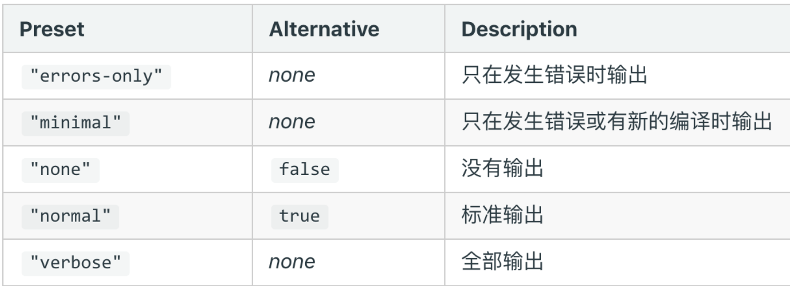
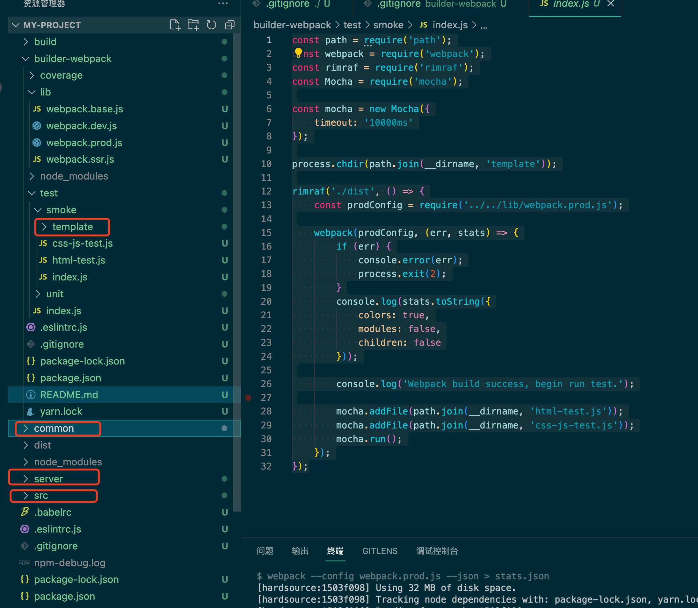
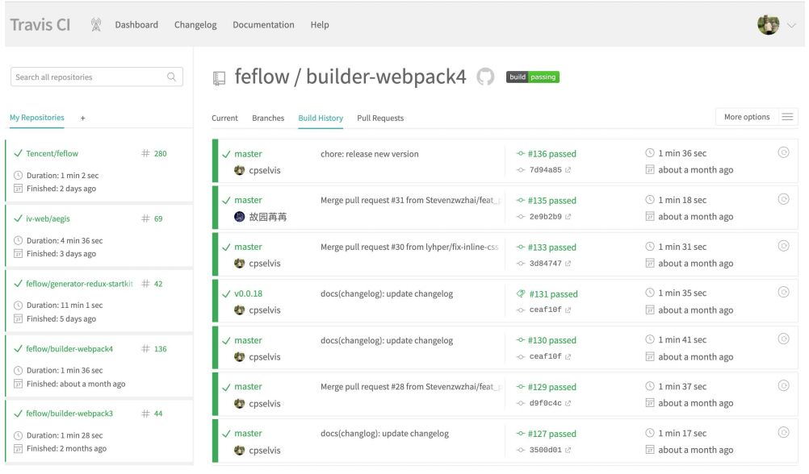
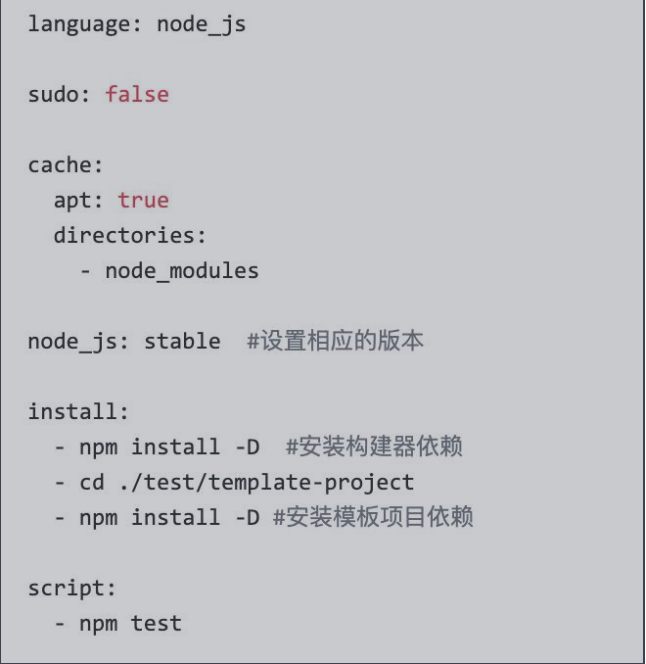
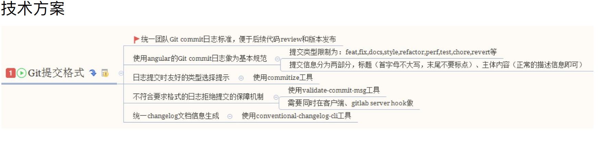
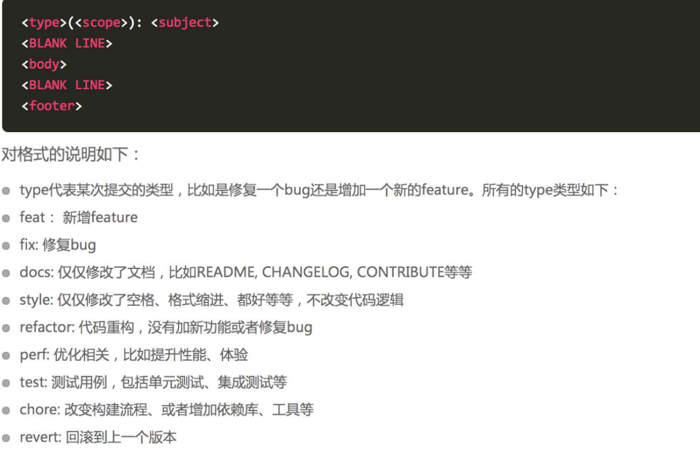
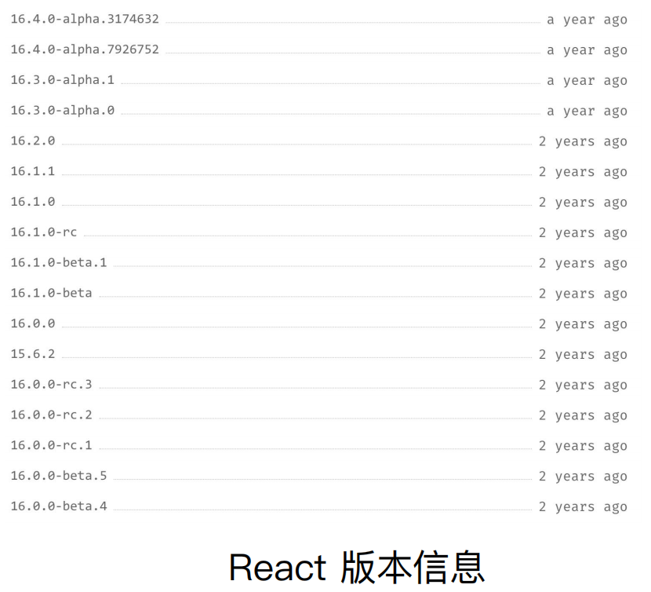

## ⾃动清理构建⽬录

```js
module.exports = {
  entry: {
    app: './src/app.js',
    search: './src/search.js'
  },

  output: {
    filename: '[name][chunkhash:8].js',
    path: __dirname + '/dist'
  },

	plugins: [
		+ new CleanWebpackPlugin()
  ]
};
```

避免构建前每次都需要⼿动删除 dist

使⽤ clean-webpack-plugin

·默认会删除 output 指定的输出⽬录

## CSS3 的属性为什么需要前缀？

- Trident(-ms) 
- Geko(-moz) 
- Webkit(-webkit) 
- Presto(-o)

```css
.box {
  -moz-border-radius: 10px;
  -webkit-border-radius: 10px;
  -o-border-radius: 10px;
  border-radius: 10px;
}
```

## PostCSS 插件 autoprefixer ⾃动补⻬ CSS3 前缀

- 使⽤ autoprefixer 插件
- 根据 Can I Use 规则（ https://caniuse.com/ ）

```js
module.exports = {
        module: {
            rules: [{
                test: /\.less$/,
                use: [
                    'style-loader',
                    'css-loader',
                    'less-loader',
                    {
                        loader: 'postcss-loader',
                        options: {
                            plugins: () => [
                                require('autoprefixer')({
                                    browsers: ["last 2 version", "> 1%", "iOS 7"]
                                })
                            ]
                        }
                    }
                ]
            }]
        }
    }
```

## 移动端 CSS px ⾃动转换成 rem

使⽤ px2rem-loader

⻚⾯渲染时计算根元素的 font-size 值 

·可以使⽤⼿淘的lib-flexible库 

·https://github.com/amfe/lib-flexible

```js
module.exports = {
        module: {
            rules: [{
                test: /\.less$/,
                use: [
                    'style-loader',
                    'css-loader',
                    'less-loader',
                    {
                        loader: "px2rem-loader",
                        options: {
                            remUnit: 75,
                            remPrecision: 8
                        }
                    }
                ]
            }]
        }
    }
```

## 资源内联的意义

##### 代码层⾯：

- ⻚⾯框架的初始化脚本
- 上报相关打点
-  css 内联避免⻚⾯闪动

##### 请求层⾯：

- 减少 HTTP ⽹络请求数
- ⼩图⽚或者字体内联 (url-loader)


## HTML 和 JS 内联

raw-loader 内联 html

<script>${require(' raw-loader!babel-loader!. /meta.html')}</script>

raw-loader 内联 JS

<script>${require('raw-loader!babel-loader!../node_modules/lib-flexible')}</script>

## CSS 内联

⽅案⼀：借助 style-loader

⽅案⼆：html-inline-css-webpack-plugin

```js
module.exports = {
        module: {
            rules: [{
                test: /\.scss$/,
                use: [{
                        loader: 'style-loader',
                        options: {
                            insertAt: 'top', // 样式插入到 <head>
                            singleton: true, //将所有的style标签合并成一个
                        }
                    },
                    "css-loader",
                    "sass-loader"
                ],
            }, ]
        },
    };
```

## 多⻚⾯应⽤(MPA)概念

每⼀次⻚⾯跳转的时候，后台服务器都会给返回⼀个新的 html ⽂档，

这种类型的⽹站也就是多⻚⽹站，也叫做多⻚应⽤。


## 多⻚⾯打包通⽤⽅案

动态获取 entry 和设置 html-webpack-plugin 数量

利⽤ glob.sync

 entry: glob.sync(path.join(__dirname, './src/*/index.js')),

```js
/*
 * @Description: webapck学习
 * @Date: 2022-07-04 09:12:51
 * @LastEditTime: 2022-07-04 19:27:41
 * @Author: siwenfeng
 */
"use strict";
const path = require("path");
const MiniCssExtractPlugin = require("mini-css-extract-plugin");
const OptimizeCSSAssetsPlugin = require("optimize-css-assets-webpack-plugin");
const HtmlWebpackPlugin = require("html-webpack-plugin");
const CleanWebpackPlugin = require('clean-webpack-plugin');
const glob = require('glob');
const setMPA = () => {
  const entry = {};
  const htmlWebpackPlugin = [];
  const entryFiles = glob.sync(path.join(__dirname, './src/*/index.js'))
  entryFiles.map(v => {
    const entryKey = v.match(/src\/(.*)\/index.js/);
    const pageName = entryKey && entryKey[1]
    entry[pageName] = v;
    htmlWebpackPlugin.push(
      new HtmlWebpackPlugin({
        template: path.join(__dirname, `src/${pageName}/index.html`),
        filename: `${pageName}.html`,
        chunks: [pageName],
        inject: true,
        minify: {
          html5: true,
          collapseWhitespace: true,
          preserveLineBreaks: false,
          minifyCSS: true,
          minifyJS: true,
          removeComments: false,
        },
      }),
    )
  })

  return {
    entry,
    htmlWebpackPlugin
  }
}
const { entry, htmlWebpackPlugin } = setMPA()
// const webpack = require('webpack');
module.exports = {
  entry,
  output: {
    path: path.resolve(__dirname, "dist"),
    filename: "[name]_[chunkhash:8].js",
  },
  mode: "production",
  module: {
    rules: [
      {
        test: /\.js$/,
        use: "babel-loader",
      },
      {
        test: /\.css$/,
        use: [
          // style-loader 和MiniCssExtractPlugin.loader冲突
          MiniCssExtractPlugin.loader,
          "css-loader",
        ],
      },
      {
        test: /\.less$/i,
        use: [
          MiniCssExtractPlugin.loader, 
          "css-loader",
          "less-loader",
          {
            loader: 'postcss-loader',
            options: {
                plugins: () => [
                    require('autoprefixer')({
                        browsers: ["last 2 version", "> 1%", "iOS 7"]
                    })
                ]
            }
          },
          {
            loader: "px2rem-loader",
            options: {
                remUnit: 75,
                remPrecision: 8
            }
          }
        ],
      },
      // {
      //   test: /\.(png|svg|jpg|jpeg|gif)$/,
      //   use: [{
      //     loader: 'url-loader',
      //     options: {
      //       limit: 102400 // 小于100kb 用base64
      //     }
      //   }],
      // },
      {
        test: /\.(png|svg|jpg|jpeg|gif)$/,
        use: [
          {
            loader: "file-loader",
            options: {
              // 文件指纹
              name: "[name]_[hash:8][ext]",
            },
          },
        ],
      },
      {
        test: /\.(woff|woff2|eot|ttf|otf)$/,
        use: [
          {
            loader: "file-loader",
            options: {
              // 文件指纹
              name: "[name]_[hash:8][ext]",
            },
          },
        ],
      },
    ],
  },
  plugins: [
    new MiniCssExtractPlugin({ filename: "[name]_[contenthash:8].css" }),
    new OptimizeCSSAssetsPlugin({
      assetNameRegExp: /\.css$/g,
      cssProcessor: require("cssnano"),
    }),
    new CleanWebpackPlugin()
  ].concat(htmlWebpackPlugin)
};

```


## 使⽤ source map

开发环境开启，线上环境关闭

· 线上排查问题的时候可以将 sourcemap 上传到错误监控系统

eval: 使⽤eval包裹模块代码

source map: 产⽣.map⽂件

cheap: 不包含列信息

inline: 将.map作为DataURI嵌⼊，不单独⽣成.map⽂件

module:包含loader的sourcemap


## 基础库分离

使⽤ html-webpack-externals-plugin

将 react、react-dom 基础

包通过 cdn 引⼊，不打⼊ bundle 中 


## 利⽤ SplitChunksPlugin 进⾏公共脚本分离

Webpack4 内置的，替代CommonsChunkPlugin插件

```js
module.exports = {
  optimization: {
  splitChunks: {
  chunks: 'async',
  minSize: 30000,
  maxSize: 0,
  minChunks: 1,
  maxAsyncRequests: 5,
  maxInitialRequests: 3,
  automaticNameDelimiter: '~',
  name: true,
  cacheGroups: {
  vendors: {
  test: /[\\/]node_modules[\\/]/,
  priority: -10
  }}}}
};
```


chunks 参数说明：

· async 异步引⼊的库进⾏分离(默认)

· initial 同步引⼊的库进⾏分离

· all 所有引⼊的库进⾏分离(推荐)


#### test: 匹配出需要分离的包

```js
module.exports = {
  optimization: {
  splitChunks: {
  cacheGroups: {
  commons: {
  test: /(react|react-dom)/,
  name: 'vendors',
  chunks: 'all'
} } } }
};
```

## 利⽤ SplitChunksPlugin 分离⻚⾯公共⽂件

minChunks: 设置最⼩引⽤次数为2次

minuSize: 分离的包体积的⼤⼩

```js
module.exports = {
optimization: {
splitChunks: {
minSize: 0,
cacheGroups: {
commons: {
name: 'commons',
chunks: 'all',
minChunks: 2
} } } }}
};
```


## tree shaking(摇树优化)

概念：1 个模块可能有多个⽅法，只要其中的某个⽅法使⽤到了，则整个⽂件都会被打到

bundle ⾥⾯去，tree shaking 就是只把⽤到的⽅法打⼊ bundle ，没⽤到的⽅法会在

uglify 阶段被擦除掉。


使⽤：webpack 默认⽀持，在 .babelrc ⾥设置 modules: false 即可

· production mode的情况下默认开启

要求：必须是 ES6 的语法，CJS 的⽅式不⽀持


## DCE (Dead code elimination)

代码不会被执⾏，不可到达

代码执⾏的结果不会被⽤到

代码只会影响死变量（只写不读）

```js
if (false) {
console.log('这段代码永远不会执行’);
}
```

## Tree-shaking 原理

利⽤ ES6 模块的特点: 

·只能作为模块顶层的语句出现

· import 的模块名只能是字符串常量

· import binding 是 immutable的

代码擦除： uglify 阶段删除⽆⽤代码

## 现象：构建后的代码存在⼤量闭包代码

编译前 (source code)


编译后（bundle.js）


## 会导致什么问题？

⼤量作⽤域包裹代码，导致体积增⼤（模块越多越明显）

运⾏代码时创建的函数作⽤域变多，内存开销变⼤

## 模块转换分析


结论：

·被 webpack 转换后的模块会带上⼀层包裹

·import 会被转换成 __webpack_require

## 进⼀步分析 webpack 的模块机制


分析：

· 打包出来的是⼀个 IIFE (匿名闭包)

· modules 是⼀个数组，每⼀项是⼀个模块初始化函数

· __webpack_require ⽤来加载模块，返回 module.exports

· 通过 WEBPACK_REQUIRE_METHOD(0) 启动程序

## scope hoisting 原理

原理：将所有模块的代码按照引⽤顺序放在⼀个函数作⽤域⾥，然后适当的重命名⼀

些变量以防⽌变量名冲突

对⽐: 通过 scope hoisting 可以减少函数声明代码和内存开销


## scope hoisting 使⽤

webpack mode 为 production 默认开启

当模块被引用多次时，不会放到一个作用域里面

必须是 ES6 语法，CJS 不⽀持

```js
module.exports = {
  entry: {
    app: './src/app.js',
    search: './src/search.js'
  },

  output: {
    filename: '[name][chunkhash:8].js',
    path: __dirname + '/dist'
  },

plugins: [
	+ new webpack.optimize.ModuleConcatenationPlugin()
  ]
};
```

## 代码分割的意义


## 懒加载 JS 脚本的⽅式

CommonJS：require.ensure

ES6：动态 import（⽬前还没有原⽣⽀持，需要 babel 转换）

## 如何使⽤动态 import?

安装 babel 插件

npm install @babel/plugin-syntax-dynamic-import --save-dev


ES6：动态 import（⽬前还没有原⽣⽀持，需要 babel 转换）

{

"plugins": ["@babel/plugin-syntax-dynamic-import"],

...

}

webpack[jsop]的方式异步请求js

## eslint

### 本地开发阶段增加 precommit 钩⼦


安装 husky

npm install husky --save-dev

增加 npm script，通过 lint-staged 增量检查修改的⽂件

```js
"scripts": {

"precommit": "lint-staged"

},

"lint-staged": {

"linters": {

"*.{js,scss}": ["eslint --fix", "git add"]

}

},
```

### ⽅案⼆：webpack 与 ESLint 集成

使⽤ eslint-loader，构建时检查 JS 规范

```js
module.exports = {

module: {

rules: [

{

test: /\.js$/,

exclude: /node_modules/,

use: [

"babel-loader", 

\+ "eslint-loader” 

]

}

]

}

};
```


# webpack 打包库和组件

webpack 除了可以⽤来打包应⽤，也可以⽤来打包 js 库

实现⼀个⼤整数加法库的打包

· 需要打包压缩版和⾮压缩版本

·⽀持 AMD/CJS/ESM 模块引⼊

## 库的⽬录结构和打包要求

打包输出的库名称: 

·未压缩版 large-number.js

·压缩版 large-number.min.js


```js
+ |- /dist

+ |- large-number.js

+ |- large-number.min.js

+ |- webpack.config.js

+ |- package.json

+ |- index.js

+ |- /src

+ |- index.js
```

## ⽀持的使⽤⽅式

⽀持 ES module

⽀持 CJS

⽀持 AMD

```js
import * as largeNumber from 'large-number';

// ...

largeNumber.add('999', '1');

const largeNumbers = require('large-number');

// ...

largeNumber.add('999', '1');

require(['large-number'], function (large-number) {

// ...

largeNumber.add('999', '1');

});
```

##### 可以直接通过 script 引⼊

```html
<!doctype html>

<html>

...

<script src="https://unpkg.com/large-number"></script>

<script>

// ...

// Global variable

largeNumber.add('999', '1');

// Property in the window object

window. largeNumber.add('999', '1');

// ...

</script>

</html>
```

## 如何将库暴露出去？

library: 指定库的全局变量

libraryTarget: ⽀持库引⼊的⽅式


```js
module.exports = {
	mode: "production",
  entry: {
  "large-number": "./src/index.js",
  "large-number.min": "./src/index.js"
  },
  output: {
    filename: "[name].js",
    library: "largeNumber",
    libraryExport: "default",
    libraryTarget: "umd"
  }

};
```

## 如何只对 .min 压缩

通过 include 设置只压缩 min.js 结尾的⽂件

```js
    module.exports = {
        mode: "none",
        entry: {
            "large-number": "./src/index.js",
            "large-number.min": "./src/index.js"
        },
        output: {
            filename: "[name].js",
            library: "largeNumber",
            libraryTarget: "umd"
        },
        optimization: {
            minimize: true,
            minimizer: [
                new TerserPlugin({
                    include: /\.min\.js$/,
                }),
            ],
        }
    };
```

## 设置⼊⼝⽂件

```js
package.json 的 main 字段为 index.js

if (process.env.NODE_ENV === "production") {

module.exports = require("./dist/large-number.min.js");

} else {

module.exports = require("./dist/large-number.js");

}
```


## 当前构建时的⽇志显示

统计信息 stats



## 如何优化命令⾏的构建⽇志

使⽤ friendly-errors-webpack-plugin

· success: 构建成功的⽇志提示

· warning: 构建警告的⽇志提示

· error: 构建报错的⽇志提示


stats 设置成 errors-only

```js
module.exports = {
entry: {
app: './src/app.js',
search: './src/search.js'
},
output: {
filename: '[name][chunkhash:8].js',
path: __dirname + '/dist'
},
plugins: [
+ new FriendlyErrorsWebpackPlugin()
],
+ stats: 'errors-only'
};
```

## 如何判断构建是否成功？

webpack4 之前的版本构建失败不会抛出错误码 (error code)

Node.js 中的 process.exit 规范

· 0 表示成功完成，回调函数中，err 为 null

· ⾮ 0 表示执⾏失败，回调函数中，err 不为 null，err.code 就是传给 exit 的数字


## 如何主动捕获并处理构建错误？

compiler 在每次构建结束后会触发 done 这 个 hook

process.exit 主动处理构建报错

```js
plugins: [
function() {
this.hooks.done.tap('done', (stats) => {
if (stats.compilation.errors && 
stats.compilation.errors.length && process.argv.indexOf('- -watch') == -1)
{
console.log('build error');
process.exit(1);
}
})
} ]
```


## 冒烟测试执行

构建是否成功 

每次构建完成 build 目录是否有内容输出 

·是否有 JS、CSS 等静态资源文件 

·是否有 HTML 文件

## 判断构建是否成功

```js
const path = require('path');
const webpack = require('webpack');
const rimraf = require('rimraf');


process.chdir(path.join(__dirname, 'template'));

rimraf('./dist', () => {
    const prodConfig = require('../../lib/webpack.prod.js');

    webpack(prodConfig, (err, stats) => {
        if (err) {
            console.error(err);
            process.exit(2);
        }
        console.log(stats.toString({
            colors: true,
            modules: false,
            children: false
        }));

        console.log('Webpack build success, begin run test.');

        mocha.addFile(path.join(__dirname, 'html-test.js'));
        mocha.addFile(path.join(__dirname, 'css-js-test.js'));
        mocha.run();
    });
});
```



template 下面包含了common server src目录下面的所有的代码 用来测试

webpack.base.config.js

```js

const autoprefixer = require('autoprefixer');
const glob = require('glob');
const path = require('path');
const CleanWebpackPlugin = require('clean-webpack-plugin');
const FriendlyErrorsWebpackPlugin = require('friendly-errors-webpack-plugin');
const HtmlWebpackPlugin = require('html-webpack-plugin');
const MiniCssExtractPlugin = require('mini-css-extract-plugin');

const projectRoot = process.cwd();

const setMPA = () => {
  const entry = {};
  const htmlWebpackPlugins = [];
  const entryFiles = glob.sync(path.join(projectRoot, './src/*/index.js'));

  Object.keys(entryFiles)
    .map((index) => {
      const entryFile = entryFiles[index];
      // '/Users/cpselvis/my-project/src/index/index.js'

      const match = entryFile.match(/src\/(.*)\/index\.js/);
      const pageName = match && match[1];

      entry[pageName] = entryFile;
      return htmlWebpackPlugins.push(
        new HtmlWebpackPlugin({
          inlineSource: '.css$',
          template: path.join(projectRoot, `./src/${pageName}/index.html`),
          filename: `${pageName}.html`,
          chunks: ['vendors', pageName],
          inject: true,
          minify: {
            html5: true,
            collapseWhitespace: true,
            preserveLineBreaks: false,
            minifyCSS: true,
            minifyJS: true,
            removeComments: false,
          },
        })
      );
    });

  return {
    entry,
    htmlWebpackPlugins,
  };
};

const { entry, htmlWebpackPlugins } = setMPA();

module.exports = {
  entry: entry,
  output: {
    path: path.join(projectRoot, 'dist'),
    filename: '[name]_[chunkhash:8].js'
  },
  module: {
    rules: [
      {
        test: /.js$/,
        use: [
          {
            loader: 'babel-loader'
          }
        ],
      },
      {
        test: /.css$/,
        use: [
          MiniCssExtractPlugin.loader,
          'css-loader',
        ],
      },
      {
        test: /.less$/,
        use: [
          MiniCssExtractPlugin.loader,
          'css-loader',
          'less-loader',
          {
            loader: 'postcss-loader',
            options: {
              plugins: () => [
                autoprefixer({
                  browsers: ['last 2 version', '>1%', 'ios 7'],
                }),
              ],
            },
          },
          {
            loader: 'px2rem-loader',
            options: {
              remUnit: 75,
              remPrecision: 8,
            },
          },
        ],
      },
      {
        test: /.(png|jpg|gif|jpeg)$/,
        use: [
          {
            loader: 'file-loader',
            options: {
              name: '[name]_[hash:8].[ext]',
            },
          },
        ],
      },
      {
        test: /.(woff|woff2|eot|ttf|otf)$/,
        use: [
          {
            loader: 'file-loader',
            options: {
              name: '[name]_[hash:8][ext]',
            },
          },
        ],
      },
    ],
  },
  plugins: [
    new MiniCssExtractPlugin({
      filename: '[name]_[contenthash:8].css',
    }),
    new CleanWebpackPlugin(),
    new FriendlyErrorsWebpackPlugin(),
    function errorPlugin() {
      this.hooks.done.tap('done', (stats) => {
        if (stats.compilation.errors && stats.compilation.errors.length && process.argv.indexOf('--watch') === -1) {
          process.exit(1);
        }
      });
    },
  ].concat(htmlWebpackPlugins),
  stats: 'errors-only',
};

```

webpack.prod.config.js

```js

const cssnano = require('cssnano');
const merge = require('webpack-merge');
const HtmlWebpackExternalsPlugin = require('html-webpack-externals-plugin');
const OptimizeCSSAssetsPlugin = require('optimize-css-assets-webpack-plugin');
const baseConfig = require('./webpack.base');

const prodConfig = {
  mode: 'production',
  plugins: [
    new OptimizeCSSAssetsPlugin({
      assetNameRegExp: /\.css$/g,
      cssProcessor: cssnano,
    }),
    new HtmlWebpackExternalsPlugin({
      externals: [
        {
          module: 'react',
          entry: 'https://11.url.cn/now/lib/16.2.0/react.min.js',
          global: 'React',
        },
        {
          module: 'react-dom',
          entry: 'https://11.url.cn/now/lib/16.2.0/react-dom.min.js',
          global: 'ReactDOM',
        },
      ],
    }),
  ],
  optimization: {
    splitChunks: {
      minSize: 0,
      cacheGroups: {
        commons: {
          name: 'vendors',
          chunks: 'all',
          minChunks: 2,
        },
      },
    },
  },
};

module.exports = merge(baseConfig, prodConfig);
```

## 判断基本功能是否正常

编写 mocha 测试用例 

·是否有 JS、CSS 等静态资源文件 

·是否有 HTML 文件

```js
const glob = require('glob-all');

describe('Checking generated css js files', () => {
    it('should generate css js files', (done) => {
        const files = glob.sync([
            './dist/index_*.js',
            './dist/index_*.css',
            './dist/search_*.js',
            './dist/search_*.css',
        ]);

        if (files.length > 0) {
            done();
        } else {
            throw new Error('no css js files generated');
        }
    });
});
```

```js
const glob = require('glob-all');

describe('Checking generated html files', () => {
    it('should generate html files', (done) => {
        const files = glob.sync([
            './dist/index.html',
            './dist/search.html'
        ]);

        if (files.length > 0) {
            done();
        } else {
            throw new Error('no html files generated');
        }
    });
});
```

## 编写单元测试用例 

技术选型：Mocha + Chai 

测试代码：describe, it, except 

测试命令：mocha add.test.js


```js
add.test.js 

const expect = require('chai').expect; 

const add = require('../src/add'); 

describe('use expect: src/add.js', () => { 

it('add(1, 2) === 3', () => { 

expect(add(1, 2).to.equal(3)); 

}); 

});
```

## 单元测试接入

1. 安装 mocha + chai 

npm i mocha chai istanbul -D 


2. 新建 test 目录，并增加 xxx.test.js 测试文件 

3. 在 package.json 中的 scripts 字段增加 test 命令 

"scripts": { 

"test": "istanbul cover ./node_modules/.bin/_mocha” 

}, 

4. 执行测试命令 

npm run test

```js

const assert = require('assert');

describe('webpack.base.js test case', () => {
    const baseConfig = require('../../lib/webpack.base.js')

    it('entry', () => {
        assert.equal(baseConfig.entry.index, '../smoke/template/src/index/index.js');
        assert.equal(baseConfig.entry.search, '../smoke/template/src/search/index.js');
    });
});
```

## 持续集成的作用

优点：

·快速发现错误 

·防止分支大幅偏离主干


核心措施是，代码集成到主干之前，必须通 

过自动化测试。只要有一个测试用例失败， 

就不能集成。



## 接入 Travis CI

1. https://travis-ci.org/ 使用 GitHub 账号登录 

2. 在 https://travis-ci.org/account/repositories 为项目开启 

3. 项目根目录下新增 .travis.yml


## travis.yml 文件内容

install 安装项目依赖

script 运行测试用例



## 发布到 npm

添加用户： npm adduser 

升级版本 

升级补丁版本号：npm version patch 

升级小版本号：npm version minor 

升级大版本号：npm version major 

发布版本：npm publish

## Git 规范和 Changelog 生成

良好的 Git commit 规范优势： 

·加快 Code Review 的流程 

·根据 Git Commit 的元数据生成 Changelog 

·后续维护者可以知道 Feature 被修改的原因



## 提交格式要求



## 本地开发阶段增加 precommit 钩子

安装 husky 

通过 commitmsg 钩子校验信息 

npm install husky --save-dev

```js

"scripts": { 
  "commitmsg": "validate-commit-msg", 
  "changelog": "conventional-changelog -p angular -i CHANGELOG.md -s -r 0" 
	},
"devDependencies": { 

"validate-commit-msg": "^2.11.1", 
"conventional-changelog-cli": "^1.2.0", 
"husky": "^0.13.1" 
}
```

## 开源项目版本信息案例

软件的版本通常由三位组成，形如： 

X.Y.Z 

版本是严格递增的，此处是：16.2.0 - 

\> 16.3.0 -> 16.3.1 

在发布重要版本时，可以发布alpha, rc 

等先行版本 

alpha和rc等修饰版本的关键字后面可 

以带上次数和meta信息



## 语义化版本

Semantic Versioning）规范格式 

次版本号：当你做了向下兼容的功能性新增， 

主版本号：当你做了不兼容的 API 修改， 

修订号：当你做了向下兼容的问题修正。

## 先行版本号

先行版本号可以作为发布正式版之前的版本，格式是在修订版本号后面加上一个连接 

号（-），再加上一连串以点（.）分割的标识符，标识符可以由英文、数字和连接号 

（[0-9A-Za-z-]）组成。

alpha：是内部测试版，一般不向外部发布，会有很多 Bug。一般只有测试人员使用。 

·beta：也是测试版，这个阶段的版本会一直加入新的功能。在 Alpha 版之后推出 

·rc：Release Candidate) 系统平台上就是发行候选版本。RC 版不会再加入新的功能了，主 

要着重于除错。