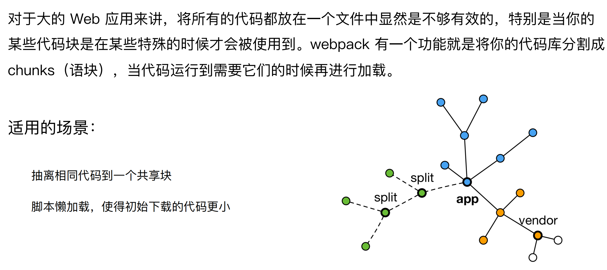

## ⾃动清理构建⽬录

```js
module.exports = {
  entry: {
    app: './src/app.js',
    search: './src/search.js'
  },

  output: {
    filename: '[name][chunkhash:8].js',
    path: __dirname + '/dist'
  },

	plugins: [
		+ new CleanWebpackPlugin()
  ]
};
```

避免构建前每次都需要⼿动删除 dist

使⽤ clean-webpack-plugin

·默认会删除 output 指定的输出⽬录

## CSS3 的属性为什么需要前缀？

- Trident(-ms) 
- Geko(-moz) 
- Webkit(-webkit) 
- Presto(-o)

```css
.box {
  -moz-border-radius: 10px;
  -webkit-border-radius: 10px;
  -o-border-radius: 10px;
  border-radius: 10px;
}
```

## PostCSS 插件 autoprefixer ⾃动补⻬ CSS3 前缀

- 使⽤ autoprefixer 插件
- 根据 Can I Use 规则（ https://caniuse.com/ ）

```js
module.exports = {
        module: {
            rules: [{
                test: /\.less$/,
                use: [
                    'style-loader',
                    'css-loader',
                    'less-loader',
                    {
                        loader: 'postcss-loader',
                        options: {
                            plugins: () => [
                                require('autoprefixer')({
                                    browsers: ["last 2 version", "> 1%", "iOS 7"]
                                })
                            ]
                        }
                    }
                ]
            }]
        }
    }
```

## 移动端 CSS px ⾃动转换成 rem

使⽤ px2rem-loader

⻚⾯渲染时计算根元素的 font-size 值 

·可以使⽤⼿淘的lib-flexible库 

·https://github.com/amfe/lib-flexible

```js
module.exports = {
        module: {
            rules: [{
                test: /\.less$/,
                use: [
                    'style-loader',
                    'css-loader',
                    'less-loader',
                    {
                        loader: "px2rem-loader",
                        options: {
                            remUnit: 75,
                            remPrecision: 8
                        }
                    }
                ]
            }]
        }
    }
```

## 资源内联的意义

##### 代码层⾯：

- ⻚⾯框架的初始化脚本
- 上报相关打点
-  css 内联避免⻚⾯闪动

##### 请求层⾯：

- 减少 HTTP ⽹络请求数
- ⼩图⽚或者字体内联 (url-loader)


## HTML 和 JS 内联

raw-loader 内联 html

<script>${require(' raw-loader!babel-loader!. /meta.html')}</script>

raw-loader 内联 JS

<script>${require('raw-loader!babel-loader!../node_modules/lib-flexible')}</script>

## CSS 内联

⽅案⼀：借助 style-loader

⽅案⼆：html-inline-css-webpack-plugin

```js
module.exports = {
        module: {
            rules: [{
                test: /\.scss$/,
                use: [{
                        loader: 'style-loader',
                        options: {
                            insertAt: 'top', // 样式插入到 <head>
                            singleton: true, //将所有的style标签合并成一个
                        }
                    },
                    "css-loader",
                    "sass-loader"
                ],
            }, ]
        },
    };
```

## 多⻚⾯应⽤(MPA)概念

每⼀次⻚⾯跳转的时候，后台服务器都会给返回⼀个新的 html ⽂档，

这种类型的⽹站也就是多⻚⽹站，也叫做多⻚应⽤。


## 多⻚⾯打包通⽤⽅案

动态获取 entry 和设置 html-webpack-plugin 数量

利⽤ glob.sync

 entry: glob.sync(path.join(__dirname, './src/*/index.js')),

```js
/*
 * @Description: webapck学习
 * @Date: 2022-07-04 09:12:51
 * @LastEditTime: 2022-07-04 19:27:41
 * @Author: siwenfeng
 */
"use strict";
const path = require("path");
const MiniCssExtractPlugin = require("mini-css-extract-plugin");
const OptimizeCSSAssetsPlugin = require("optimize-css-assets-webpack-plugin");
const HtmlWebpackPlugin = require("html-webpack-plugin");
const CleanWebpackPlugin = require('clean-webpack-plugin');
const glob = require('glob');
const setMPA = () => {
  const entry = {};
  const htmlWebpackPlugin = [];
  const entryFiles = glob.sync(path.join(__dirname, './src/*/index.js'))
  entryFiles.map(v => {
    const entryKey = v.match(/src\/(.*)\/index.js/);
    const pageName = entryKey && entryKey[1]
    entry[pageName] = v;
    htmlWebpackPlugin.push(
      new HtmlWebpackPlugin({
        template: path.join(__dirname, `src/${pageName}/index.html`),
        filename: `${pageName}.html`,
        chunks: [pageName],
        inject: true,
        minify: {
          html5: true,
          collapseWhitespace: true,
          preserveLineBreaks: false,
          minifyCSS: true,
          minifyJS: true,
          removeComments: false,
        },
      }),
    )
  })

  return {
    entry,
    htmlWebpackPlugin
  }
}
const { entry, htmlWebpackPlugin } = setMPA()
// const webpack = require('webpack');
module.exports = {
  entry,
  output: {
    path: path.resolve(__dirname, "dist"),
    filename: "[name]_[chunkhash:8].js",
  },
  mode: "production",
  module: {
    rules: [
      {
        test: /\.js$/,
        use: "babel-loader",
      },
      {
        test: /\.css$/,
        use: [
          // style-loader 和MiniCssExtractPlugin.loader冲突
          MiniCssExtractPlugin.loader,
          "css-loader",
        ],
      },
      {
        test: /\.less$/i,
        use: [
          MiniCssExtractPlugin.loader, 
          "css-loader",
          "less-loader",
          {
            loader: 'postcss-loader',
            options: {
                plugins: () => [
                    require('autoprefixer')({
                        browsers: ["last 2 version", "> 1%", "iOS 7"]
                    })
                ]
            }
          },
          {
            loader: "px2rem-loader",
            options: {
                remUnit: 75,
                remPrecision: 8
            }
          }
        ],
      },
      // {
      //   test: /\.(png|svg|jpg|jpeg|gif)$/,
      //   use: [{
      //     loader: 'url-loader',
      //     options: {
      //       limit: 102400 // 小于100kb 用base64
      //     }
      //   }],
      // },
      {
        test: /\.(png|svg|jpg|jpeg|gif)$/,
        use: [
          {
            loader: "file-loader",
            options: {
              // 文件指纹
              name: "[name]_[hash:8][ext]",
            },
          },
        ],
      },
      {
        test: /\.(woff|woff2|eot|ttf|otf)$/,
        use: [
          {
            loader: "file-loader",
            options: {
              // 文件指纹
              name: "[name]_[hash:8][ext]",
            },
          },
        ],
      },
    ],
  },
  plugins: [
    new MiniCssExtractPlugin({ filename: "[name]_[contenthash:8].css" }),
    new OptimizeCSSAssetsPlugin({
      assetNameRegExp: /\.css$/g,
      cssProcessor: require("cssnano"),
    }),
    new CleanWebpackPlugin()
  ].concat(htmlWebpackPlugin)
};

```


## 使⽤ source map

开发环境开启，线上环境关闭

· 线上排查问题的时候可以将 sourcemap 上传到错误监控系统

eval: 使⽤eval包裹模块代码

source map: 产⽣.map⽂件

cheap: 不包含列信息

inline: 将.map作为DataURI嵌⼊，不单独⽣成.map⽂件

module:包含loader的sourcemap


## 基础库分离

使⽤ html-webpack-externals-plugin

将 react、react-dom 基础

包通过 cdn 引⼊，不打⼊ bundle 中 


## 利⽤ SplitChunksPlugin 进⾏公共脚本分离

Webpack4 内置的，替代CommonsChunkPlugin插件

```js
module.exports = {
  optimization: {
  splitChunks: {
  chunks: 'async',
  minSize: 30000,
  maxSize: 0,
  minChunks: 1,
  maxAsyncRequests: 5,
  maxInitialRequests: 3,
  automaticNameDelimiter: '~',
  name: true,
  cacheGroups: {
  vendors: {
  test: /[\\/]node_modules[\\/]/,
  priority: -10
  }}}}
};
```


chunks 参数说明：

· async 异步引⼊的库进⾏分离(默认)

· initial 同步引⼊的库进⾏分离

· all 所有引⼊的库进⾏分离(推荐)


#### test: 匹配出需要分离的包

```js
module.exports = {
  optimization: {
  splitChunks: {
  cacheGroups: {
  commons: {
  test: /(react|react-dom)/,
  name: 'vendors',
  chunks: 'all'
} } } }
};
```

## 利⽤ SplitChunksPlugin 分离⻚⾯公共⽂件

minChunks: 设置最⼩引⽤次数为2次

minuSize: 分离的包体积的⼤⼩

```js
module.exports = {
optimization: {
splitChunks: {
minSize: 0,
cacheGroups: {
commons: {
name: 'commons',
chunks: 'all',
minChunks: 2
} } } }}
};
```


## tree shaking(摇树优化)

概念：1 个模块可能有多个⽅法，只要其中的某个⽅法使⽤到了，则整个⽂件都会被打到

bundle ⾥⾯去，tree shaking 就是只把⽤到的⽅法打⼊ bundle ，没⽤到的⽅法会在

uglify 阶段被擦除掉。


使⽤：webpack 默认⽀持，在 .babelrc ⾥设置 modules: false 即可

· production mode的情况下默认开启

要求：必须是 ES6 的语法，CJS 的⽅式不⽀持


## DCE (Dead code elimination)

代码不会被执⾏，不可到达

代码执⾏的结果不会被⽤到

代码只会影响死变量（只写不读）

```js
if (false) {
console.log('这段代码永远不会执行’);
}
```

## Tree-shaking 原理

利⽤ ES6 模块的特点: 

·只能作为模块顶层的语句出现

· import 的模块名只能是字符串常量

· import binding 是 immutable的

代码擦除： uglify 阶段删除⽆⽤代码

## 现象：构建后的代码存在⼤量闭包代码

编译前 (source code)


编译后（bundle.js）


## 会导致什么问题？

⼤量作⽤域包裹代码，导致体积增⼤（模块越多越明显）

运⾏代码时创建的函数作⽤域变多，内存开销变⼤

## 模块转换分析


结论：

·被 webpack 转换后的模块会带上⼀层包裹

·import 会被转换成 __webpack_require

## 进⼀步分析 webpack 的模块机制


分析：

· 打包出来的是⼀个 IIFE (匿名闭包)

· modules 是⼀个数组，每⼀项是⼀个模块初始化函数

· __webpack_require ⽤来加载模块，返回 module.exports

· 通过 WEBPACK_REQUIRE_METHOD(0) 启动程序

## scope hoisting 原理

原理：将所有模块的代码按照引⽤顺序放在⼀个函数作⽤域⾥，然后适当的重命名⼀

些变量以防⽌变量名冲突

对⽐: 通过 scope hoisting 可以减少函数声明代码和内存开销


## scope hoisting 使⽤

webpack mode 为 production 默认开启

当模块被引用多次时，不会放到一个作用域里面

必须是 ES6 语法，CJS 不⽀持

```js
module.exports = {
  entry: {
    app: './src/app.js',
    search: './src/search.js'
  },

  output: {
    filename: '[name][chunkhash:8].js',
    path: __dirname + '/dist'
  },

plugins: [
	+ new webpack.optimize.ModuleConcatenationPlugin()
  ]
};
```

## 代码分割的意义

