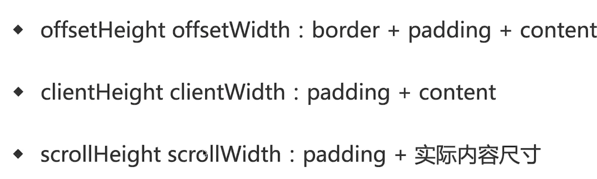

```html
  <style>
    * {
      margin: 0;
      padding: 0;
    }
    #container {
      width: 300px;
      height: 200px;
      padding: 20px;
      border: 5px solid red;
      margin: 20px;
      box-sizing: border-box;
      
      overflow: auto;
    }
    #content {
      width: 600px;
      height: 500px;
      display: inline-block;
      background: skyblue;
    }
  </style>
</head>
<body>
  <div id="container">
    <!-- <div id="content">

    </div> -->
  </div>
  <script>
    const dom =  document.querySelector('#container');
    
    
  </script>
```

