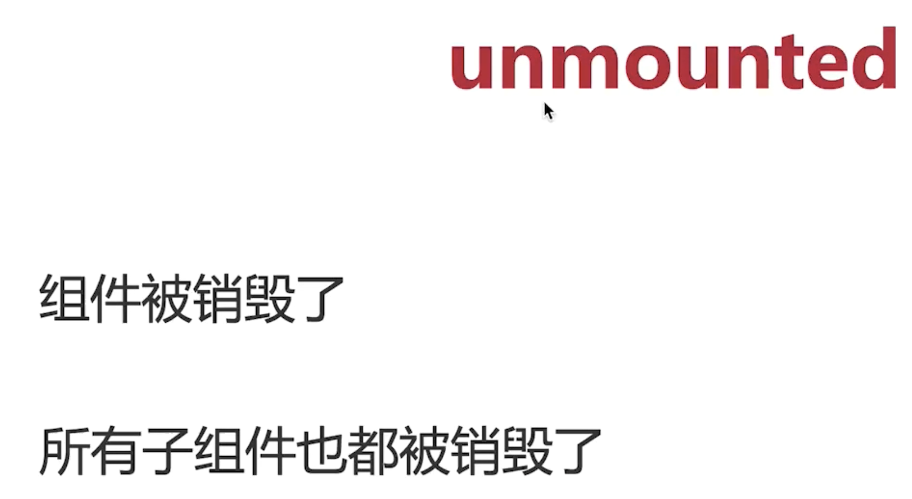

一.vue常用生命周期：

1. beforeCreate: data和el均未初始化，值为undefined
2. created: Vue 实例观察的数据对象data已经配置好，已经可以得到data的值且data已经具有响应式，但Vue 实例使⽤的根 DOM 元素el还未初始化
3. beforeMount: 在模板编译之后,渲染之前触发;data和el均已经初始化，但此时el并没有渲染进数据，el的值为“虚拟”的元素节点
4. mounted: 此时el已经渲染完成并挂载到实例上;
5. beforeUpdate: 数据更新时调⽤,发⽣在虚拟DOM重新渲染和打补丁之前;可以在该⽣命周期中进⼀步的更改状态,不会触发附加的重渲染过程;
6. updated: 在数据改变后,模板改变后触发; 数据更改导致的虚拟DOM重新渲染和打补丁,在这之后调⽤该⽣命周期函数; 调⽤该⽣命周期函数时,组件DOM已经更新,可以执⾏依赖DOM的操作;
7. activated: 使⽤ keep-alive 时调⽤
8. deactivated: 使⽤ keep-alive 时调⽤
9. beforeDestroy: 组件卸载前触发,可以在此时清理事件,计时器或者取消订阅操作;
10. destoryed: 实例销毁之后调⽤; 调⽤后, vue实例指⽰的所有东西都会解除绑定,所有的事件监听器会被⼀处,所有的⼦实例也会被销毁

二. ⽗⼦组件初始化时 ⽣命周期的执⾏顺序
⽗beforeCreate -> ⽗created -> ⽗beforeMount -> ⼦beforeCreate -> ⼦created -> ⼦beforeMount -> ⼦mounted->⽗mounted
三. ⽗⼦组件数据更新时 ⽣命周期的执⾏顺序
⽗beforeUpdate -> ⼦beforeUpdate -> ⼦updated -> ⽗updated
四. ⽗⼦组件销毁时 ⽣命周期的执⾏顺序
⽗beforeDestroy -> ⼦beforeDestroy -> ⼦destroyed -> ⽗destroyed
