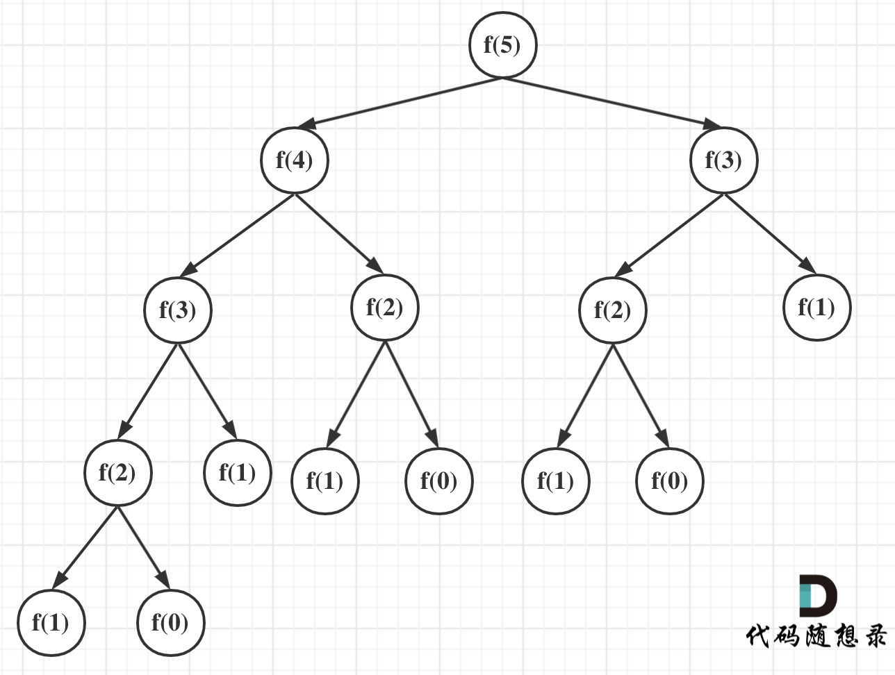

```js
// 递归 性能很有问题
function fbnc(n) {
      if (n === 0) {
        return 0;
      }
      if (n === 1) {
        return 1
      }
      return fbnc(n - 1) + fbnc(n - 2)
    }
console.time()
console.log(fbnc(40))
console.timeEnd()
```

```js
    function fbnc(n) {
      let n1 = 0; // 缓存第一个
      let n2 = 1; // 缓存第二个
      let res;
      for(let i = 2; i <= n; i++) {
        res = n1 + n2;
        n1 = n2; // 移动
        n2 = res; // 移动
      }
      return res;
    }
    console.time()
    console.log(fbnc(9))
    console.timeEnd()
```

## 递归求斐波那契数列的性能分析

先来看一下求斐波那契数的递归写法。

```cpp
int fibonacci(int i) {
       if(i <= 0) return 0;
       if(i == 1) return 1;
       return fibonacci(i-1) + fibonacci(i-2);
}
```


对于递归算法来说，代码一般都比较简短，从算法逻辑上看，所用的存储空间也非常少，但运行时需要内存可不见得会少。

### [#](https://programmercarl.com/前序/递归算法的时间与空间复杂度分析.html#时间复杂度分析)时间复杂度分析

来看看这个求斐波那契的递归算法的时间复杂度是多少呢？

在讲解递归时间复杂度的时候，我们提到了递归算法的时间复杂度本质上是要看: **递归的次数 \* 每次递归的时间复杂度**。

可以看出上面的代码每次递归都是O(1)的操作。再来看递归了多少次，这里将i为5作为输入的递归过程 抽象成一棵递归树，如图：



从图中，可以看出f(5)是由f(4)和f(3)相加而来，那么f(4)是由f(3)和f(2)相加而来 以此类推。

在这棵二叉树中每一个节点都是一次递归，那么这棵树有多少个节点呢？

我们之前也有说到，一棵深度（按根节点深度为1）为k的二叉树最多可以有 2^k - 1 个节点。

所以该递归算法的时间复杂度为O(2^n)，这个复杂度是非常大的，随着n的增大，耗时是指数上升的。

来做一个实验，大家可以有一个直观的感受。


